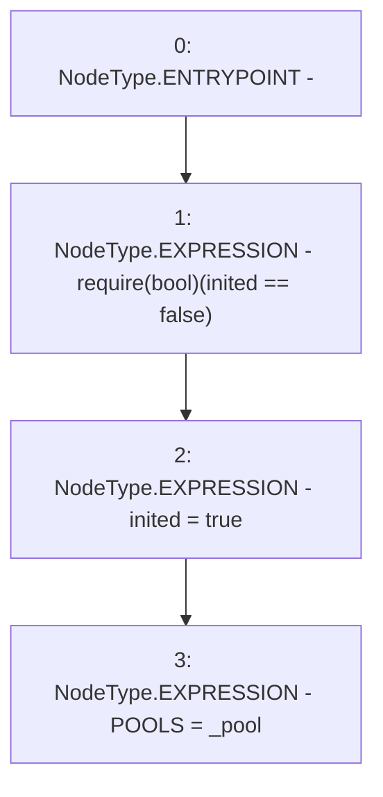

# Context: Factory.init

**Contract:** `Factory` (Inherits: None)
**Signature:** `init(address)`
**Method Selector ID:** `0x19ab453c`
**Visibility:** `public`
**Environment-Free:** `Yes`
**Modifiers:** None

### State Variables Interaction
- **Reads:** inited
- **Writes:** POOLS, inited

### Assertion Checks & Business Requirements
- require/assert: `require(bool)(inited == false)`

### Environment & Verification Flags
- **Uses Foundry Cheatcodes:** No
- **Has Echidna Properties:** No

### Internal Calls Tree
- None

### External Calls / Value Transfers
- None

### Control Flow Graph (CFG)


### Source Mapping
Declared in: `contracts/Factory.sol` on lines **27** to **31**

```solidity
    function init(address _pool) public {
        require(inited == false);
        inited = true;
        POOLS = _pool;
    }

```
