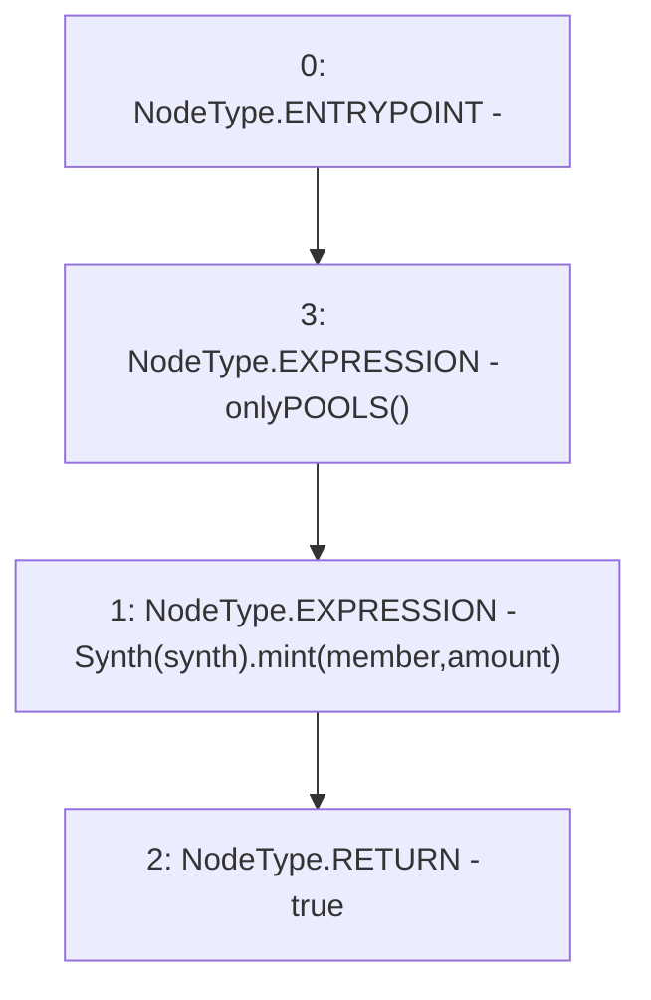

# Context: Factory.mintSynth

**Contract:** `Factory` (Inherits: None)
**Signature:** `mintSynth(address,address,uint256) returns (bool)`
**Method Selector ID:** `0x5bf0abbc`
**Visibility:** `external`
**Environment-Free:** `No (reads EVM state context)`
**Modifiers:**
- `onlyPOOLS`
  ```solidity
  modifier onlyPOOLS() {
          require(msg.sender == POOLS, "!POOLS");
          _;
      }
  ```

### State Variables Interaction
- **Reads:** None
- **Writes:** None

### Environment & Verification Flags
- **Uses Foundry Cheatcodes:** No
- **Has Echidna Properties:** No

### Internal Calls Tree
- None

### External Calls / Value Transfers
- `Synth.HIGH_LEVEL_CALL, dest:TMP_112(Synth), function:mint, arguments:['member', 'amount']  `

### Control Flow Graph (CFG)


### Source Mapping
Declared in: `contracts/Factory.sol` on lines **43** to **46**

```solidity
    function mintSynth(address synth, address member, uint amount) external onlyPOOLS returns(bool) {
         Synth(synth).mint(member, amount); 
        return true;
    }

```
