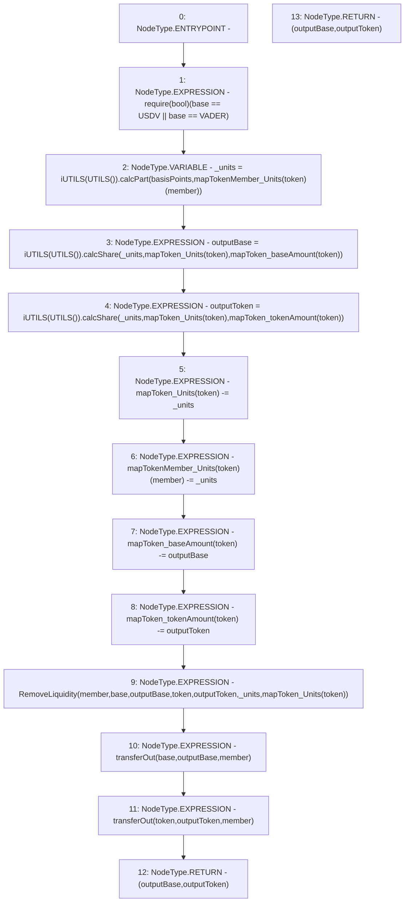

# Context: Pools._removeLiquidity

**Contract:** `Pools` (Inherits: None)
**Signature:** `_removeLiquidity(address,address,uint256,address) returns (uint256, uint256)`
**Method Selector ID:** `Internal (No Method ID)`
**Visibility:** `internal`
**Environment-Free:** `Yes`
**Modifiers:** None

### State Variables Interaction
- **Reads:** USDV, VADER, mapTokenMember_Units, mapToken_Units, mapToken_baseAmount, mapToken_tokenAmount
- **Writes:** mapTokenMember_Units, mapToken_Units, mapToken_baseAmount, mapToken_tokenAmount

### Assertion Checks & Business Requirements
- require/assert: `require(bool)(base == USDV || base == VADER)`

### Environment & Verification Flags
- **Uses Foundry Cheatcodes:** No
- **Has Echidna Properties:** No

### Internal Calls Tree
- None

### External Calls / Value Transfers
- `iUTILS.TMP_151(uint256) = HIGH_LEVEL_CALL, dest:TMP_150(iUTILS), function:calcShare, arguments:['_units', 'REF_81', 'REF_82']  `
- `iUTILS.TMP_145(uint256) = HIGH_LEVEL_CALL, dest:TMP_144(iUTILS), function:calcPart, arguments:['basisPoints', 'REF_76']  `
- `iUTILS.TMP_148(uint256) = HIGH_LEVEL_CALL, dest:TMP_147(iUTILS), function:calcShare, arguments:['_units', 'REF_78', 'REF_79']  `

### Control Flow Graph (CFG)


### Source Mapping
Declared in: `contracts/Pools.sol` on lines **83** to **96**

```solidity
    function _removeLiquidity(address base, address token, uint basisPoints, address member) internal returns (uint outputBase, uint outputToken) {
        require(base == USDV || base == VADER);
        uint _units = iUTILS(UTILS()).calcPart(basisPoints, mapTokenMember_Units[token][member]);
        outputBase = iUTILS(UTILS()).calcShare(_units, mapToken_Units[token], mapToken_baseAmount[token]);
        outputToken = iUTILS(UTILS()).calcShare(_units, mapToken_Units[token], mapToken_tokenAmount[token]);
        mapToken_Units[token] -=_units;
        mapTokenMember_Units[token][member] -= _units;
        mapToken_baseAmount[token] -= outputBase;
        mapToken_tokenAmount[token] -= outputToken;
        emit RemoveLiquidity(member, base, outputBase, token, outputToken, _units, mapToken_Units[token]);
        transferOut(base, outputBase, member);
        transferOut(token, outputToken, member);
        return (outputBase, outputToken);
    }

```
