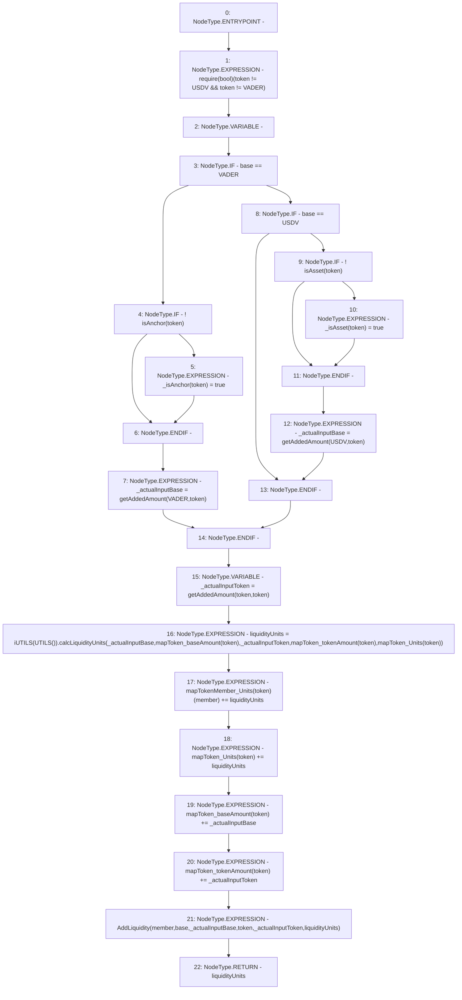

# Context: Pools.addLiquidity

**Contract:** `Pools` (Inherits: None)
**Signature:** `addLiquidity(address,address,address) returns (uint256)`
**Method Selector ID:** `0xfde3b265`
**Visibility:** `external`
**Environment-Free:** `Yes`
**Modifiers:** None

### State Variables Interaction
- **Reads:** USDV, VADER, mapTokenMember_Units, mapToken_Units, mapToken_baseAmount, mapToken_tokenAmount
- **Writes:** _isAnchor, _isAsset, mapTokenMember_Units, mapToken_Units, mapToken_baseAmount, mapToken_tokenAmount

### Assertion Checks & Business Requirements
- require/assert: `require(bool)(token != USDV && token != VADER)`

### Environment & Verification Flags
- **Uses Foundry Cheatcodes:** No
- **Has Echidna Properties:** No

### Internal Calls Tree
- None

### External Calls / Value Transfers
- `iUTILS.TMP_137(uint256) = HIGH_LEVEL_CALL, dest:TMP_136(iUTILS), function:calcLiquidityUnits, arguments:['_actualInputBase', 'REF_66', '_actualInputToken', 'REF_67', 'REF_68']  `

### Control Flow Graph (CFG)


### Source Mapping
Declared in: `contracts/Pools.sol` on lines **54** to **75**

```solidity
    function addLiquidity(address base, address token, address member) external returns(uint liquidityUnits) {
        require(token != USDV && token != VADER); // Prohibited
        uint _actualInputBase;
        if(base == VADER){
            if(!isAnchor(token)){               // If new Anchor
                _isAnchor[token] = true;
            }
            _actualInputBase = getAddedAmount(VADER, token);
        } else if (base == USDV) {
            if(!isAsset(token)){               // If new Asset
                _isAsset[token] = true;
            }
            _actualInputBase = getAddedAmount(USDV, token);
        }
        uint _actualInputToken = getAddedAmount(token, token);
        liquidityUnits = iUTILS(UTILS()).calcLiquidityUnits(_actualInputBase, mapToken_baseAmount[token], _actualInputToken, mapToken_tokenAmount[token], mapToken_Units[token]);
        mapTokenMember_Units[token][member] += liquidityUnits;  // Add units to member
        mapToken_Units[token] += liquidityUnits;                // Add in total
        mapToken_baseAmount[token] += _actualInputBase;         // Add BASE
        mapToken_tokenAmount[token] += _actualInputToken;       // Add token
        emit AddLiquidity(member, base, _actualInputBase, token, _actualInputToken, liquidityUnits);
    }

```
