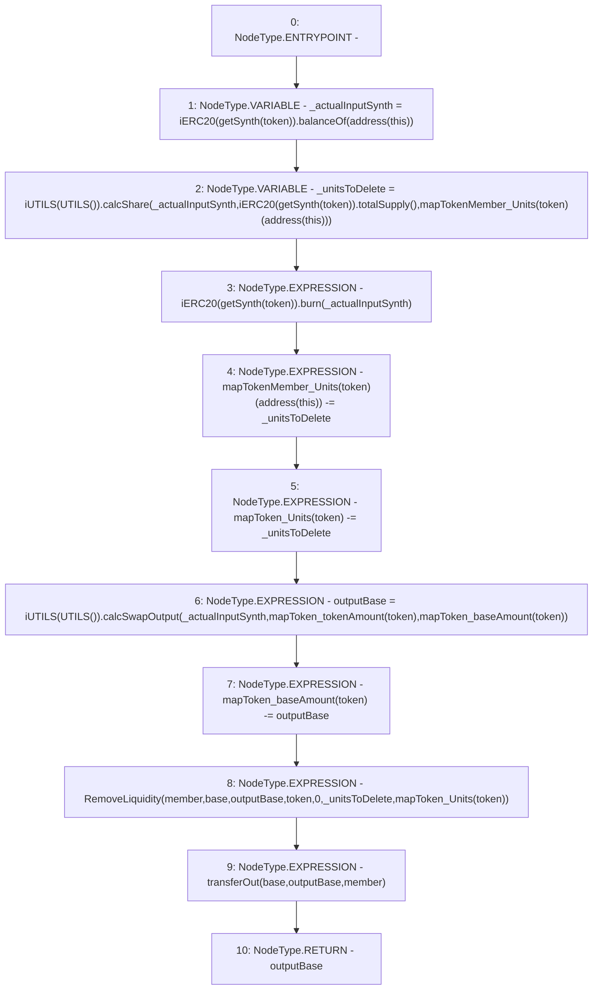

# Context: Pools.burnSynth

**Contract:** `Pools` (Inherits: None)
**Signature:** `burnSynth(address,address,address) returns (uint256)`
**Method Selector ID:** `0xe3adb2f6`
**Visibility:** `external`
**Environment-Free:** `Yes`
**Modifiers:** None

### State Variables Interaction
- **Reads:** mapTokenMember_Units, mapToken_Units, mapToken_baseAmount, mapToken_tokenAmount
- **Writes:** mapTokenMember_Units, mapToken_Units, mapToken_baseAmount

### Environment & Verification Flags
- **Uses Foundry Cheatcodes:** No
- **Has Echidna Properties:** No

### Internal Calls Tree
- None

### External Calls / Value Transfers
- `iUTILS.TMP_210(uint256) = HIGH_LEVEL_CALL, dest:TMP_205(iUTILS), function:calcShare, arguments:['_actualInputSynth', 'TMP_208', 'REF_124']  `
- `iERC20.TMP_208(uint256) = HIGH_LEVEL_CALL, dest:TMP_207(iERC20), function:totalSupply, arguments:[]  `
- `iERC20.TMP_203(uint256) = HIGH_LEVEL_CALL, dest:TMP_201(iERC20), function:balanceOf, arguments:['TMP_202']  `
- `iUTILS.TMP_217(uint256) = HIGH_LEVEL_CALL, dest:TMP_216(iUTILS), function:calcSwapOutput, arguments:['_actualInputSynth', 'REF_130', 'REF_131']  `
- `iERC20.HIGH_LEVEL_CALL, dest:TMP_212(iERC20), function:burn, arguments:['_actualInputSynth']  `

### Control Flow Graph (CFG)


### Source Mapping
Declared in: `contracts/Pools.sol` on lines **155** to **165**

```solidity
    function burnSynth(address base, address token, address member) external returns (uint outputBase) {
        uint _actualInputSynth = iERC20(getSynth(token)).balanceOf(address(this));  // Get input
        uint _unitsToDelete = iUTILS(UTILS()).calcShare(_actualInputSynth, iERC20(getSynth(token)).totalSupply(), mapTokenMember_Units[token][address(this)]); // Pro rata
        iERC20(getSynth(token)).burn(_actualInputSynth);                            // Burn it
        mapTokenMember_Units[token][address(this)] -= _unitsToDelete;               // Delete units for self
        mapToken_Units[token] -= _unitsToDelete;                                    // Delete units
        outputBase = iUTILS(UTILS()).calcSwapOutput(_actualInputSynth, mapToken_tokenAmount[token], mapToken_baseAmount[token]);    // Get output
        mapToken_baseAmount[token] -= outputBase;                                   // Remove BASE
        emit RemoveLiquidity(member, base, outputBase, token, 0, _unitsToDelete, mapToken_Units[token]);        // Remove liquidity event
        transferOut(base, outputBase, member);                                      // Send BASE to member
    }

```
