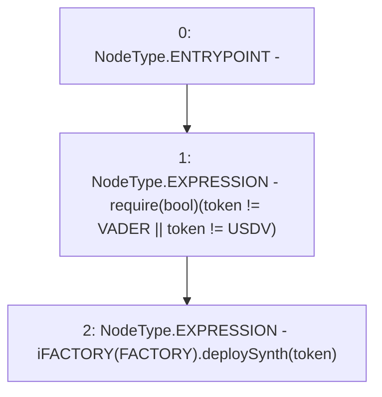

# Context: Pools.deploySynth

**Contract:** `Pools` (Inherits: None)
**Signature:** `deploySynth(address)`
**Method Selector ID:** `0x8e80bddf`
**Visibility:** `external`
**Environment-Free:** `Yes`
**Modifiers:** None

### State Variables Interaction
- **Reads:** FACTORY, USDV, VADER
- **Writes:** None

### Assertion Checks & Business Requirements
- require/assert: `require(bool)(token != VADER || token != USDV)`

### Environment & Verification Flags
- **Uses Foundry Cheatcodes:** No
- **Has Echidna Properties:** No

### Internal Calls Tree
- None

### External Calls / Value Transfers
- `iFACTORY.TMP_183(address) = HIGH_LEVEL_CALL, dest:TMP_182(iFACTORY), function:deploySynth, arguments:['token']  `

### Control Flow Graph (CFG)


### Source Mapping
Declared in: `contracts/Pools.sol` on lines **137** to **140**

```solidity
    function deploySynth(address token) external {
        require(token != VADER || token != USDV);
        iFACTORY(FACTORY).deploySynth(token);
    }

```
