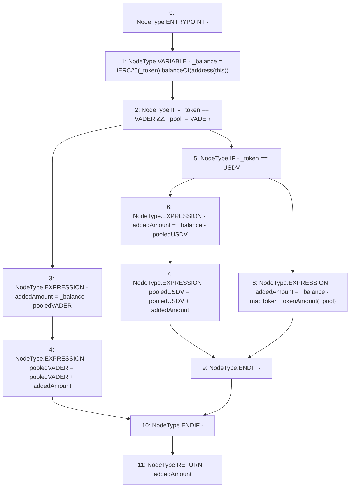

# Context: Pools.getAddedAmount

**Contract:** `Pools` (Inherits: None)
**Signature:** `getAddedAmount(address,address) returns (uint256)`
**Method Selector ID:** `Internal (No Method ID)`
**Visibility:** `internal`
**Environment-Free:** `Yes`
**Modifiers:** None

### State Variables Interaction
- **Reads:** USDV, VADER, mapToken_tokenAmount, pooledUSDV, pooledVADER
- **Writes:** pooledUSDV, pooledVADER

### Environment & Verification Flags
- **Uses Foundry Cheatcodes:** No
- **Has Echidna Properties:** No

### Internal Calls Tree
- None

### External Calls / Value Transfers
- `iERC20.TMP_238(uint256) = HIGH_LEVEL_CALL, dest:TMP_236(iERC20), function:balanceOf, arguments:['TMP_237']  `

### Control Flow Graph (CFG)


### Source Mapping
Declared in: `contracts/Pools.sol` on lines **192** to **203**

```solidity
    function getAddedAmount(address _token, address _pool) internal returns(uint addedAmount) {
        uint _balance = iERC20(_token).balanceOf(address(this));
        if(_token == VADER && _pool != VADER){  // Want to know added VADER
            addedAmount = _balance - pooledVADER;
            pooledVADER = pooledVADER + addedAmount;
        } else if(_token == USDV) {             // Want to know added USDV
            addedAmount = _balance - pooledUSDV;
            pooledUSDV = pooledUSDV + addedAmount;
        } else {                                // Want to know added Asset/Anchor
            addedAmount = _balance - mapToken_tokenAmount[_pool];
        }
    }

```
