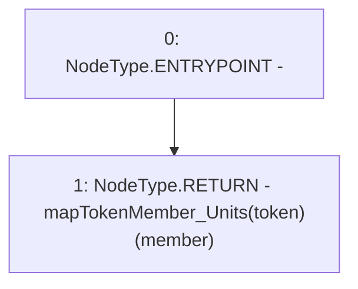

# Context: Pools.getMemberUnits

**Contract:** `Pools` (Inherits: None)
**Signature:** `getMemberUnits(address,address) returns (uint256)`
**Method Selector ID:** `0x24ef3750`
**Visibility:** `external`
**Environment-Free:** `Yes`
**Modifiers:** None

### State Variables Interaction
- **Reads:** mapTokenMember_Units
- **Writes:** None

### Environment & Verification Flags
- **Uses Foundry Cheatcodes:** No
- **Has Echidna Properties:** No

### Internal Calls Tree
- None

### External Calls / Value Transfers
- None

### Control Flow Graph (CFG)


### Source Mapping
Declared in: `contracts/Pools.sol` on lines **236** to **238**

```solidity
    function getMemberUnits(address token, address member) external view returns(uint) {
        return mapTokenMember_Units[token][member];
    }

```
