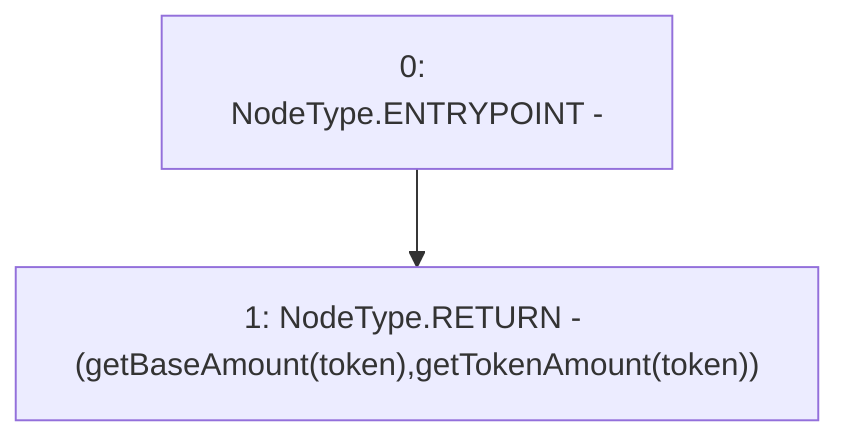

# Context: Pools.getPoolAmounts

**Contract:** `Pools` (Inherits: None)
**Signature:** `getPoolAmounts(address) returns (uint256, uint256)`
**Method Selector ID:** `0x903443b9`
**Visibility:** `external`
**Environment-Free:** `Yes`
**Modifiers:** None

### State Variables Interaction
- **Reads:** None
- **Writes:** None

### Environment & Verification Flags
- **Uses Foundry Cheatcodes:** No
- **Has Echidna Properties:** No

### Internal Calls Tree
- None

### External Calls / Value Transfers
- None

### Control Flow Graph (CFG)


### Source Mapping
Declared in: `contracts/Pools.sol` on lines **224** to **226**

```solidity
    function getPoolAmounts(address token) external view returns(uint, uint) {
        return (getBaseAmount(token), getTokenAmount(token));
    }

```
