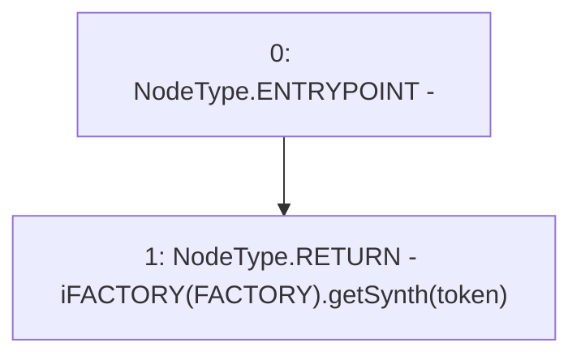

# Context: Pools.getSynth

**Contract:** `Pools` (Inherits: None)
**Signature:** `getSynth(address) returns (address)`
**Method Selector ID:** `0xdcec8116`
**Visibility:** `public`
**Environment-Free:** `Yes`
**Modifiers:** None

### State Variables Interaction
- **Reads:** FACTORY
- **Writes:** None

### Environment & Verification Flags
- **Uses Foundry Cheatcodes:** No
- **Has Echidna Properties:** No

### Internal Calls Tree
- None

### External Calls / Value Transfers
- `iFACTORY.TMP_259(address) = HIGH_LEVEL_CALL, dest:TMP_258(iFACTORY), function:getSynth, arguments:['token']  `

### Control Flow Graph (CFG)


### Source Mapping
Declared in: `contracts/Pools.sol` on lines **239** to **241**

```solidity
    function getSynth(address token) public view returns (address) {
        return iFACTORY(FACTORY).getSynth(token);
    }

```
