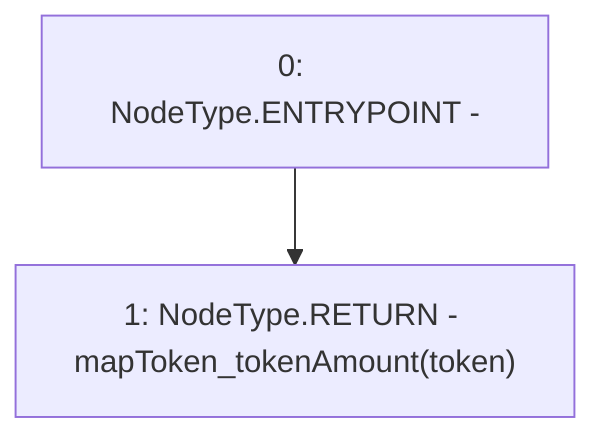

# Context: Pools.getTokenAmount

**Contract:** `Pools` (Inherits: None)
**Signature:** `getTokenAmount(address) returns (uint256)`
**Method Selector ID:** `0xe6ae1a97`
**Visibility:** `public`
**Environment-Free:** `Yes`
**Modifiers:** None

### State Variables Interaction
- **Reads:** mapToken_tokenAmount
- **Writes:** None

### Environment & Verification Flags
- **Uses Foundry Cheatcodes:** No
- **Has Echidna Properties:** No

### Internal Calls Tree
- None

### External Calls / Value Transfers
- None

### Control Flow Graph (CFG)


### Source Mapping
Declared in: `contracts/Pools.sol` on lines **230** to **232**

```solidity
    function getTokenAmount(address token) public view returns(uint) {
        return mapToken_tokenAmount[token];
    }

```
