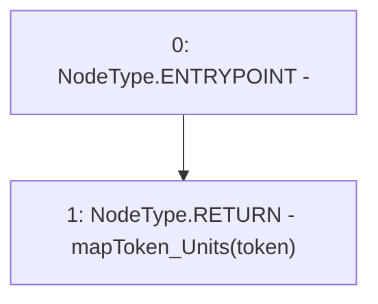

# Context: Pools.getUnits

**Contract:** `Pools` (Inherits: None)
**Signature:** `getUnits(address) returns (uint256)`
**Method Selector ID:** `0x0fefbc09`
**Visibility:** `external`
**Environment-Free:** `Yes`
**Modifiers:** None

### State Variables Interaction
- **Reads:** mapToken_Units
- **Writes:** None

### Environment & Verification Flags
- **Uses Foundry Cheatcodes:** No
- **Has Echidna Properties:** No

### Internal Calls Tree
- None

### External Calls / Value Transfers
- None

### Control Flow Graph (CFG)


### Source Mapping
Declared in: `contracts/Pools.sol` on lines **233** to **235**

```solidity
    function getUnits(address token) external view returns(uint) {
        return mapToken_Units[token];
    }

```
