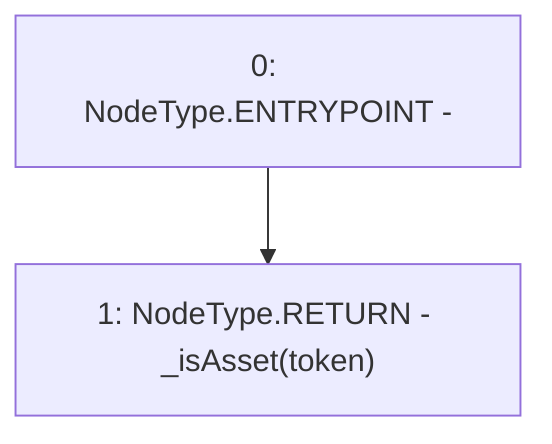

# Context: Pools.isAsset

**Contract:** `Pools` (Inherits: None)
**Signature:** `isAsset(address) returns (bool)`
**Method Selector ID:** `0xc87fa42a`
**Visibility:** `public`
**Environment-Free:** `Yes`
**Modifiers:** None

### State Variables Interaction
- **Reads:** _isAsset
- **Writes:** None

### Environment & Verification Flags
- **Uses Foundry Cheatcodes:** No
- **Has Echidna Properties:** No

### Internal Calls Tree
- None

### External Calls / Value Transfers
- None

### Control Flow Graph (CFG)


### Source Mapping
Declared in: `contracts/Pools.sol` on lines **218** to **220**

```solidity
    function isAsset(address token) public view returns(bool) {
        return _isAsset[token];
    }

```
