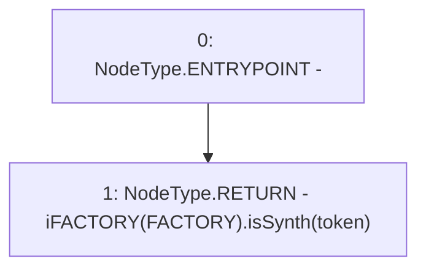

# Context: Pools.isSynth

**Contract:** `Pools` (Inherits: None)
**Signature:** `isSynth(address) returns (bool)`
**Method Selector ID:** `0x5e0237ea`
**Visibility:** `public`
**Environment-Free:** `Yes`
**Modifiers:** None

### State Variables Interaction
- **Reads:** FACTORY
- **Writes:** None

### Environment & Verification Flags
- **Uses Foundry Cheatcodes:** No
- **Has Echidna Properties:** No

### Internal Calls Tree
- None

### External Calls / Value Transfers
- `iFACTORY.TMP_261(bool) = HIGH_LEVEL_CALL, dest:TMP_260(iFACTORY), function:isSynth, arguments:['token']  `

### Control Flow Graph (CFG)


### Source Mapping
Declared in: `contracts/Pools.sol` on lines **242** to **244**

```solidity
    function isSynth(address token) public view returns (bool) {
        return iFACTORY(FACTORY).isSynth(token);
    }

```
