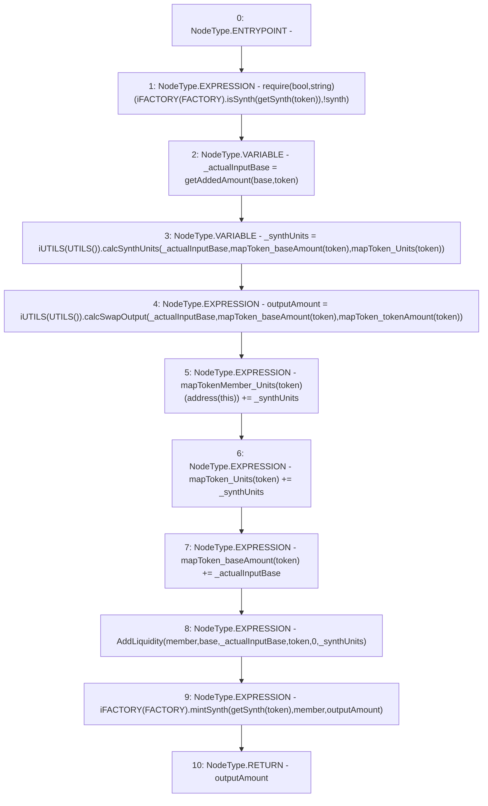

# Context: Pools.mintSynth

**Contract:** `Pools` (Inherits: None)
**Signature:** `mintSynth(address,address,address) returns (uint256)`
**Method Selector ID:** `0xd016347e`
**Visibility:** `external`
**Environment-Free:** `Yes`
**Modifiers:** None

### State Variables Interaction
- **Reads:** FACTORY, mapTokenMember_Units, mapToken_Units, mapToken_baseAmount, mapToken_tokenAmount
- **Writes:** mapTokenMember_Units, mapToken_Units, mapToken_baseAmount

### Assertion Checks & Business Requirements
- require/assert: `require(bool,string)(iFACTORY(FACTORY).isSynth(getSynth(token)),!synth)`

### Environment & Verification Flags
- **Uses Foundry Cheatcodes:** No
- **Has Echidna Properties:** No

### Internal Calls Tree
- None

### External Calls / Value Transfers
- `iUTILS.TMP_191(uint256) = HIGH_LEVEL_CALL, dest:TMP_190(iUTILS), function:calcSynthUnits, arguments:['_actualInputBase', 'REF_110', 'REF_111']  `
- `iFACTORY.TMP_199(bool) = HIGH_LEVEL_CALL, dest:TMP_197(iFACTORY), function:mintSynth, arguments:['TMP_198', 'member', 'outputAmount']  `
- `iFACTORY.TMP_186(bool) = HIGH_LEVEL_CALL, dest:TMP_184(iFACTORY), function:isSynth, arguments:['TMP_185']  `
- `iUTILS.TMP_194(uint256) = HIGH_LEVEL_CALL, dest:TMP_193(iUTILS), function:calcSwapOutput, arguments:['_actualInputBase', 'REF_113', 'REF_114']  `

### Control Flow Graph (CFG)


### Source Mapping
Declared in: `contracts/Pools.sol` on lines **143** to **153**

```solidity
    function mintSynth(address base, address token, address member) external returns (uint outputAmount) {
        require(iFACTORY(FACTORY).isSynth(getSynth(token)), "!synth");
        uint _actualInputBase = getAddedAmount(base, token);                    // Get input
        uint _synthUnits = iUTILS(UTILS()).calcSynthUnits(_actualInputBase, mapToken_baseAmount[token], mapToken_Units[token]);     // Get Units
        outputAmount = iUTILS(UTILS()).calcSwapOutput(_actualInputBase, mapToken_baseAmount[token], mapToken_tokenAmount[token]);   // Get output
        mapTokenMember_Units[token][address(this)] += _synthUnits;                  // Add units for self
        mapToken_Units[token] += _synthUnits;                                       // Add supply
        mapToken_baseAmount[token] += _actualInputBase;                             // Add BASE 
        emit AddLiquidity(member, base, _actualInputBase, token, 0, _synthUnits);   // Add Liquidity Event
        iFACTORY(FACTORY).mintSynth(getSynth(token), member, outputAmount);         // Ask factory to mint to member
    }

```
