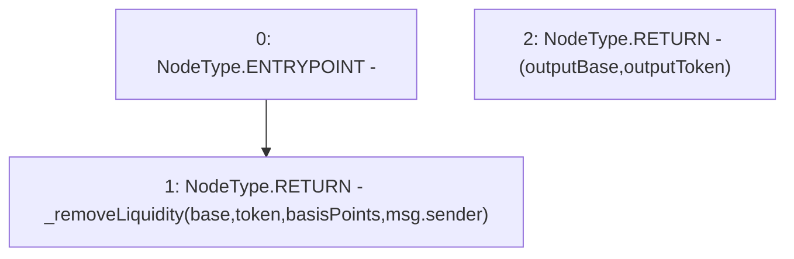

# Context: Pools.removeLiquidityDirectly

**Contract:** `Pools` (Inherits: None)
**Signature:** `removeLiquidityDirectly(address,address,uint256) returns (uint256, uint256)`
**Method Selector ID:** `0x40ace434`
**Visibility:** `external`
**Environment-Free:** `No (reads EVM state context)`
**Modifiers:** None

### State Variables Interaction
- **Reads:** None
- **Writes:** None

### Environment & Verification Flags
- **Uses Foundry Cheatcodes:** No
- **Has Echidna Properties:** No

### Internal Calls Tree
- None

### External Calls / Value Transfers
- None

### Control Flow Graph (CFG)


### Source Mapping
Declared in: `contracts/Pools.sol` on lines **80** to **82**

```solidity
    function removeLiquidityDirectly(address base, address token, uint basisPoints) external returns (uint outputBase, uint outputToken) {
        return _removeLiquidity(base, token, basisPoints, msg.sender); // If want to interact directly
    }

```
