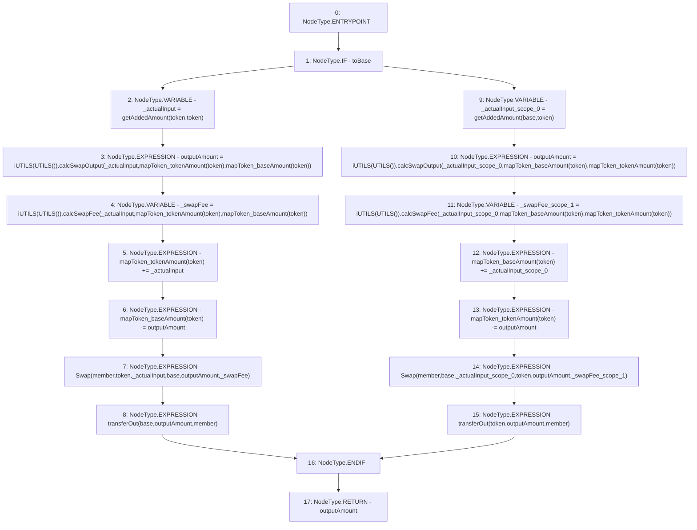

# Context: Pools.swap

**Contract:** `Pools` (Inherits: None)
**Signature:** `swap(address,address,address,bool) returns (uint256)`
**Method Selector ID:** `0xefc34aab`
**Visibility:** `external`
**Environment-Free:** `Yes`
**Modifiers:** None

### State Variables Interaction
- **Reads:** mapToken_baseAmount, mapToken_tokenAmount
- **Writes:** mapToken_baseAmount, mapToken_tokenAmount

### Environment & Verification Flags
- **Uses Foundry Cheatcodes:** No
- **Has Echidna Properties:** No

### Internal Calls Tree
- None

### External Calls / Value Transfers
- `iUTILS.TMP_161(uint256) = HIGH_LEVEL_CALL, dest:TMP_160(iUTILS), function:calcSwapFee, arguments:['_actualInput', 'REF_93', 'REF_94']  `
- `iUTILS.TMP_167(uint256) = HIGH_LEVEL_CALL, dest:TMP_166(iUTILS), function:calcSwapOutput, arguments:['_actualInput_scope_0', 'REF_98', 'REF_99']  `
- `iUTILS.TMP_170(uint256) = HIGH_LEVEL_CALL, dest:TMP_169(iUTILS), function:calcSwapFee, arguments:['_actualInput_scope_0', 'REF_101', 'REF_102']  `
- `iUTILS.TMP_158(uint256) = HIGH_LEVEL_CALL, dest:TMP_157(iUTILS), function:calcSwapOutput, arguments:['_actualInput', 'REF_90', 'REF_91']  `

### Control Flow Graph (CFG)


### Source Mapping
Declared in: `contracts/Pools.sol` on lines **101** to **119**

```solidity
    function swap(address base, address token, address member, bool toBase) external returns (uint outputAmount) {
        if(toBase){
            uint _actualInput = getAddedAmount(token, token);
            outputAmount = iUTILS(UTILS()).calcSwapOutput(_actualInput, mapToken_tokenAmount[token], mapToken_baseAmount[token]);
            uint _swapFee = iUTILS(UTILS()).calcSwapFee(_actualInput, mapToken_tokenAmount[token], mapToken_baseAmount[token]);
            mapToken_tokenAmount[token] += _actualInput;
            mapToken_baseAmount[token] -= outputAmount;
            emit Swap(member, token, _actualInput, base, outputAmount, _swapFee);
            transferOut(base, outputAmount, member);
        } else {
            uint _actualInput = getAddedAmount(base, token);
            outputAmount = iUTILS(UTILS()).calcSwapOutput(_actualInput, mapToken_baseAmount[token], mapToken_tokenAmount[token]);
            uint _swapFee = iUTILS(UTILS()).calcSwapFee(_actualInput, mapToken_baseAmount[token], mapToken_tokenAmount[token]);
            mapToken_baseAmount[token] += _actualInput;
            mapToken_tokenAmount[token] -= outputAmount;
            emit Swap(member, base, _actualInput, token, outputAmount, _swapFee);
            transferOut(token, outputAmount, member);
        }
    }

```
