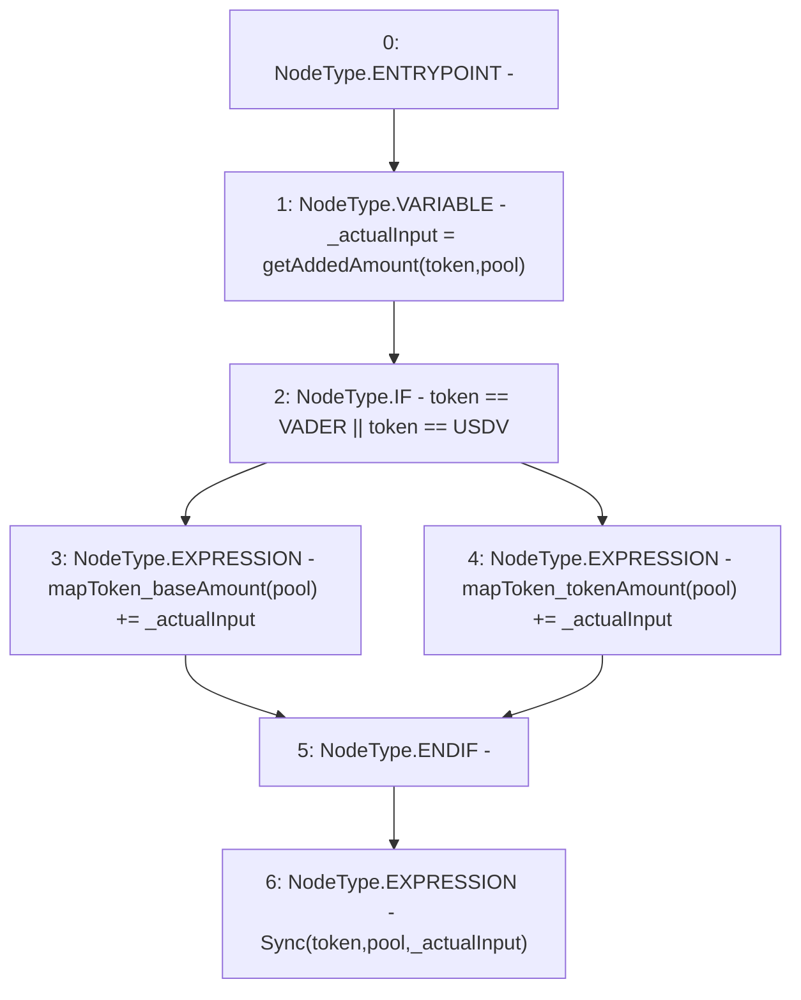

# Context: Pools.sync

**Contract:** `Pools` (Inherits: None)
**Signature:** `sync(address,address)`
**Method Selector ID:** `0x3041949b`
**Visibility:** `external`
**Environment-Free:** `Yes`
**Modifiers:** None

### State Variables Interaction
- **Reads:** USDV, VADER, mapToken_baseAmount, mapToken_tokenAmount
- **Writes:** mapToken_baseAmount, mapToken_tokenAmount

### Environment & Verification Flags
- **Uses Foundry Cheatcodes:** No
- **Has Echidna Properties:** No

### Internal Calls Tree
- None

### External Calls / Value Transfers
- None

### Control Flow Graph (CFG)


### Source Mapping
Declared in: `contracts/Pools.sol` on lines **122** to **132**

```solidity
    function sync(address token, address pool) external {
        uint _actualInput = getAddedAmount(token, pool);
        if (token == VADER || token == USDV){
            mapToken_baseAmount[pool] += _actualInput;
        } else {
            mapToken_tokenAmount[pool] += _actualInput;
        // } else if(isSynth()){
        //     //burnSynth && deleteUnits
        }
        emit Sync(token, pool, _actualInput);
    }

```
