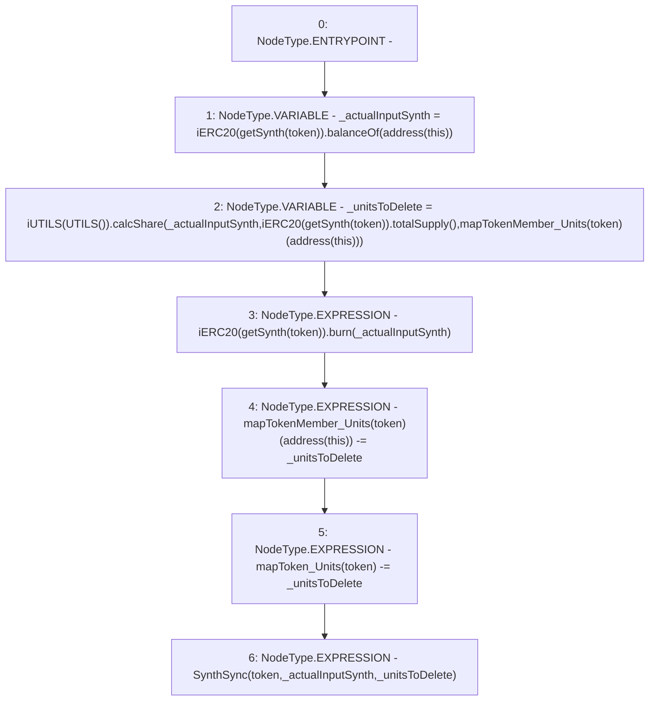

# Context: Pools.syncSynth

**Contract:** `Pools` (Inherits: None)
**Signature:** `syncSynth(address)`
**Method Selector ID:** `0x469f5c1e`
**Visibility:** `external`
**Environment-Free:** `Yes`
**Modifiers:** None

### State Variables Interaction
- **Reads:** mapTokenMember_Units, mapToken_Units
- **Writes:** mapTokenMember_Units, mapToken_Units

### Environment & Verification Flags
- **Uses Foundry Cheatcodes:** No
- **Has Echidna Properties:** No

### Internal Calls Tree
- None

### External Calls / Value Transfers
- `iERC20.TMP_228(uint256) = HIGH_LEVEL_CALL, dest:TMP_227(iERC20), function:totalSupply, arguments:[]  `
- `iERC20.TMP_223(uint256) = HIGH_LEVEL_CALL, dest:TMP_221(iERC20), function:balanceOf, arguments:['TMP_222']  `
- `iUTILS.TMP_230(uint256) = HIGH_LEVEL_CALL, dest:TMP_225(iUTILS), function:calcShare, arguments:['_actualInputSynth', 'TMP_228', 'REF_138']  `
- `iERC20.HIGH_LEVEL_CALL, dest:TMP_232(iERC20), function:burn, arguments:['_actualInputSynth']  `

### Control Flow Graph (CFG)


### Source Mapping
Declared in: `contracts/Pools.sol` on lines **167** to **174**

```solidity
    function syncSynth(address token) external {
        uint _actualInputSynth = iERC20(getSynth(token)).balanceOf(address(this));  // Get input
        uint _unitsToDelete = iUTILS(UTILS()).calcShare(_actualInputSynth, iERC20(getSynth(token)).totalSupply(), mapTokenMember_Units[token][address(this)]); // Pro rata
        iERC20(getSynth(token)).burn(_actualInputSynth);                            // Burn it
        mapTokenMember_Units[token][address(this)] -= _unitsToDelete;               // Delete units for self
        mapToken_Units[token] -= _unitsToDelete;                                    // Delete units
        emit SynthSync(token, _actualInputSynth, _unitsToDelete);
    }

```
