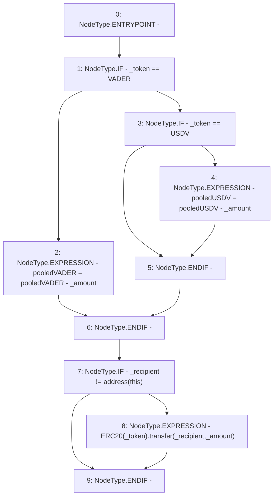

# Context: Pools.transferOut

**Contract:** `Pools` (Inherits: None)
**Signature:** `transferOut(address,uint256,address)`
**Method Selector ID:** `Internal (No Method ID)`
**Visibility:** `internal`
**Environment-Free:** `Yes`
**Modifiers:** None

### State Variables Interaction
- **Reads:** USDV, VADER, pooledUSDV, pooledVADER
- **Writes:** pooledUSDV, pooledVADER

### Environment & Verification Flags
- **Uses Foundry Cheatcodes:** No
- **Has Echidna Properties:** No

### Internal Calls Tree
- None

### External Calls / Value Transfers
- `iERC20.TMP_255(bool) = HIGH_LEVEL_CALL, dest:TMP_254(iERC20), function:transfer, arguments:['_recipient', '_amount']  `

### Control Flow Graph (CFG)


### Source Mapping
Declared in: `contracts/Pools.sol` on lines **204** to **213**

```solidity
    function transferOut(address _token, uint _amount, address _recipient) internal {
        if(_token == VADER){
            pooledVADER = pooledVADER - _amount; // Accounting
        } else if(_token == USDV) {
            pooledUSDV = pooledUSDV - _amount;  // Accounting
        }
        if(_recipient != address(this)){
            iERC20(_token).transfer(_recipient, _amount);
        }
    }

```
