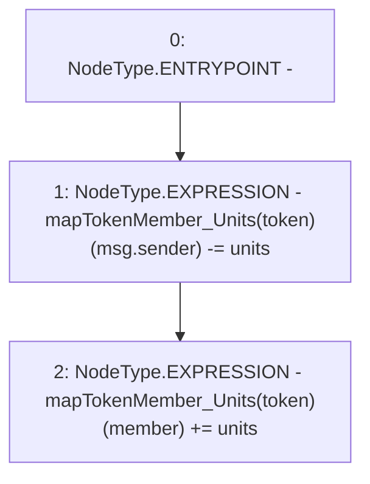

# Context: Pools.unlockUnits

**Contract:** `Pools` (Inherits: None)
**Signature:** `unlockUnits(uint256,address,address)`
**Method Selector ID:** `0x798e23d5`
**Visibility:** `external`
**Environment-Free:** `No (reads EVM state context)`
**Modifiers:** None

### State Variables Interaction
- **Reads:** mapTokenMember_Units
- **Writes:** mapTokenMember_Units

### Environment & Verification Flags
- **Uses Foundry Cheatcodes:** No
- **Has Echidna Properties:** No

### Internal Calls Tree
- None

### External Calls / Value Transfers
- None

### Control Flow Graph (CFG)


### Source Mapping
Declared in: `contracts/Pools.sol` on lines **184** to **187**

```solidity
    function unlockUnits(uint units, address token, address member) external {
        mapTokenMember_Units[token][msg.sender] -= units;      
        mapTokenMember_Units[token][member] += units;
    }

```
