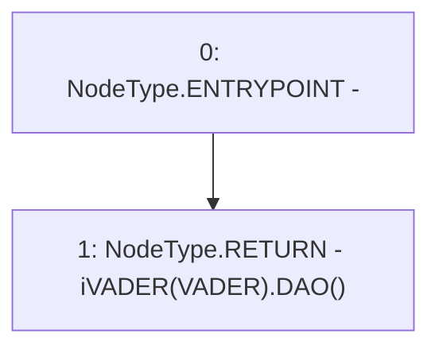

# Context: Router.DAO

**Contract:** `Router` (Inherits: None)
**Signature:** `DAO() returns (address)`
**Method Selector ID:** `0x98fabd3a`
**Visibility:** `public`
**Environment-Free:** `Yes`
**Modifiers:** None

### State Variables Interaction
- **Reads:** VADER
- **Writes:** None

### Environment & Verification Flags
- **Uses Foundry Cheatcodes:** No
- **Has Echidna Properties:** No

### Internal Calls Tree
- None

### External Calls / Value Transfers
- `iVADER.TMP_592(address) = HIGH_LEVEL_CALL, dest:TMP_591(iVADER), function:DAO, arguments:[]  `

### Control Flow Graph (CFG)


### Source Mapping
Declared in: `contracts/Router.sol` on lines **467** to **469**

```solidity
    function DAO() public view returns(address){
        return iVADER(VADER).DAO();
    }

```
