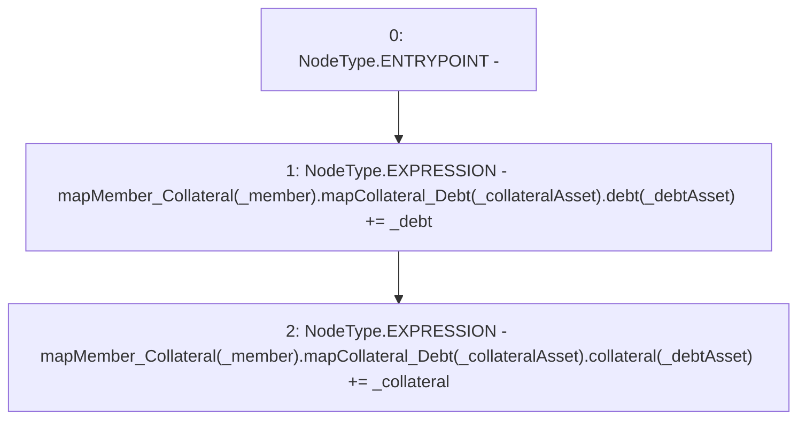

# Context: Router._addDebtToMember

**Contract:** `Router` (Inherits: None)
**Signature:** `_addDebtToMember(address,uint256,address,uint256,address)`
**Method Selector ID:** `Internal (No Method ID)`
**Visibility:** `internal`
**Environment-Free:** `Yes`
**Modifiers:** None

### State Variables Interaction
- **Reads:** mapMember_Collateral
- **Writes:** mapMember_Collateral

### Environment & Verification Flags
- **Uses Foundry Cheatcodes:** No
- **Has Echidna Properties:** No

### Internal Calls Tree
- None

### External Calls / Value Transfers
- None

### Control Flow Graph (CFG)


### Source Mapping
Declared in: `contracts/Router.sol` on lines **417** to **420**

```solidity
    function _addDebtToMember(address _member, uint _collateral, address _collateralAsset, uint _debt, address _debtAsset) internal {
        mapMember_Collateral[_member].mapCollateral_Debt[_collateralAsset].debt[_debtAsset] += _debt;
        mapMember_Collateral[_member].mapCollateral_Debt[_collateralAsset].collateral[_debtAsset] += _collateral;
    }

```
