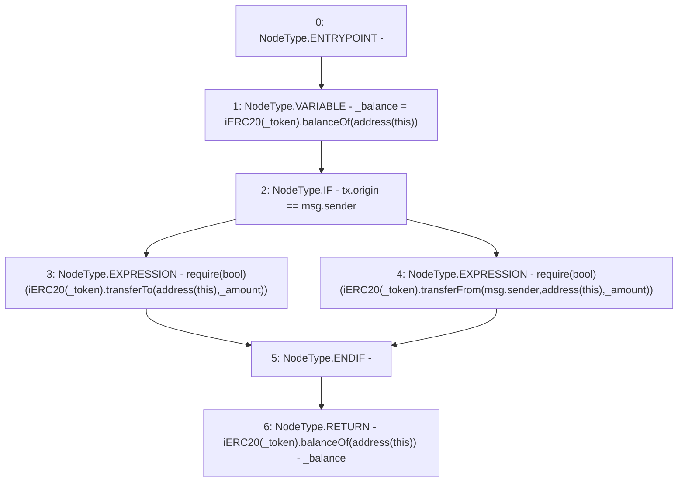

# Context: Router._getFunds

**Contract:** `Router` (Inherits: None)
**Signature:** `_getFunds(address,uint256) returns (uint256)`
**Method Selector ID:** `Internal (No Method ID)`
**Visibility:** `internal`
**Environment-Free:** `No (reads EVM state context)`
**Modifiers:** None

### State Variables Interaction
- **Reads:** None
- **Writes:** None

### Assertion Checks & Business Requirements
- require/assert: `require(bool)(iERC20(_token).transferTo(address(this),_amount))`
- require/assert: `require(bool)(iERC20(_token).transferFrom(msg.sender,address(this),_amount))`

### Environment & Verification Flags
- **Uses Foundry Cheatcodes:** No
- **Has Echidna Properties:** No

### Internal Calls Tree
- None

### External Calls / Value Transfers
- `iERC20.TMP_549(bool) = HIGH_LEVEL_CALL, dest:TMP_547(iERC20), function:transferTo, arguments:['TMP_548', '_amount']  `
- `iERC20.TMP_557(uint256) = HIGH_LEVEL_CALL, dest:TMP_555(iERC20), function:balanceOf, arguments:['TMP_556']  `
- `iERC20.TMP_553(bool) = HIGH_LEVEL_CALL, dest:TMP_551(iERC20), function:transferFrom, arguments:['msg.sender', 'TMP_552', '_amount']  `
- `iERC20.TMP_545(uint256) = HIGH_LEVEL_CALL, dest:TMP_543(iERC20), function:balanceOf, arguments:['TMP_544']  `

### Control Flow Graph (CFG)


### Source Mapping
Declared in: `contracts/Router.sol` on lines **403** to **411**

```solidity
    function _getFunds(address _token, uint _amount) internal returns(uint) {
        uint _balance = iERC20(_token).balanceOf(address(this));
        if(tx.origin==msg.sender){
            require(iERC20(_token).transferTo(address(this), _amount));
        }else{
            require(iERC20(_token).transferFrom(msg.sender, address(this), _amount));
        }
        return iERC20(_token).balanceOf(address(this)) - _balance;
    }

```
