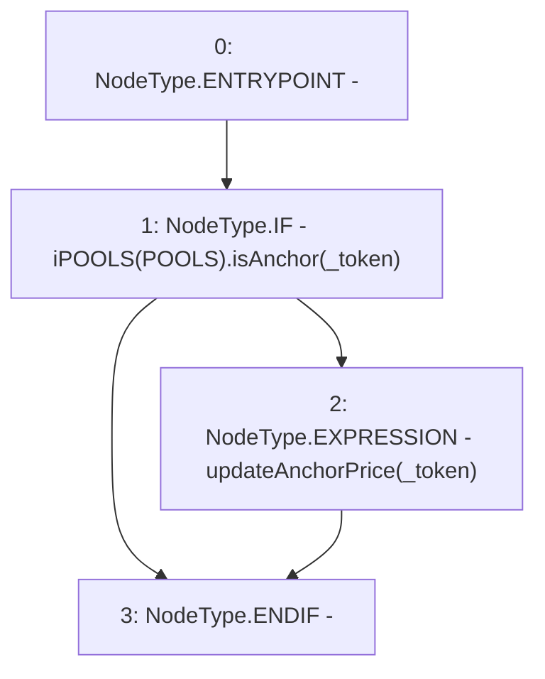

# Context: Router._handleAnchorPriceUpdate

**Contract:** `Router` (Inherits: None)
**Signature:** `_handleAnchorPriceUpdate(address)`
**Method Selector ID:** `Internal (No Method ID)`
**Visibility:** `internal`
**Environment-Free:** `Yes`
**Modifiers:** None

### State Variables Interaction
- **Reads:** POOLS
- **Writes:** None

### Environment & Verification Flags
- **Uses Foundry Cheatcodes:** No
- **Has Echidna Properties:** No

### Internal Calls Tree
- None

### External Calls / Value Transfers
- `iPOOLS.TMP_438(bool) = HIGH_LEVEL_CALL, dest:TMP_437(iPOOLS), function:isAnchor, arguments:['_token']  `

### Control Flow Graph (CFG)


### Source Mapping
Declared in: `contracts/Router.sol` on lines **278** to **282**

```solidity
    function _handleAnchorPriceUpdate(address _token) internal{
        if(iPOOLS(POOLS).isAnchor(_token)){
            updateAnchorPrice(_token);
        }
    }

```
