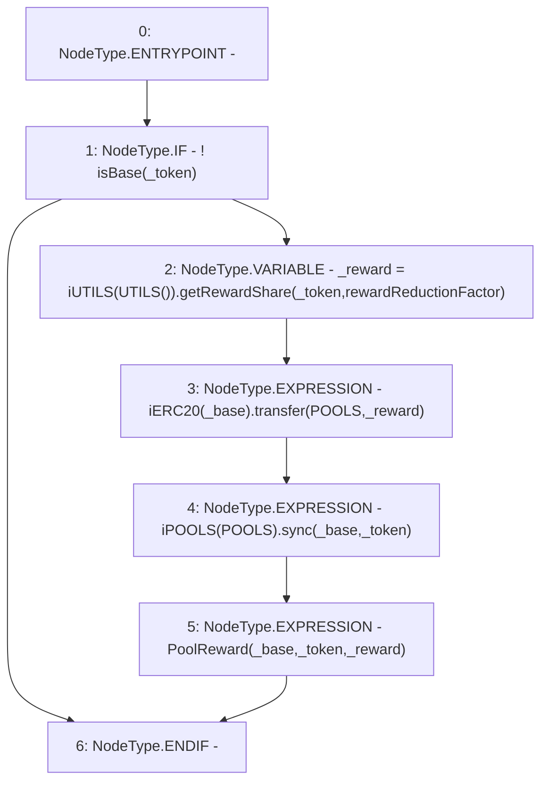

# Context: Router._handlePoolReward

**Contract:** `Router` (Inherits: None)
**Signature:** `_handlePoolReward(address,address)`
**Method Selector ID:** `Internal (No Method ID)`
**Visibility:** `internal`
**Environment-Free:** `Yes`
**Modifiers:** None

### State Variables Interaction
- **Reads:** POOLS, rewardReductionFactor
- **Writes:** None

### Environment & Verification Flags
- **Uses Foundry Cheatcodes:** No
- **Has Echidna Properties:** No

### Internal Calls Tree
- None

### External Calls / Value Transfers
- `iERC20.TMP_356(bool) = HIGH_LEVEL_CALL, dest:TMP_355(iERC20), function:transfer, arguments:['POOLS', '_reward']  `
- `iUTILS.TMP_354(uint256) = HIGH_LEVEL_CALL, dest:TMP_353(iUTILS), function:getRewardShare, arguments:['_token', 'rewardReductionFactor']  `
- `iPOOLS.HIGH_LEVEL_CALL, dest:TMP_357(iPOOLS), function:sync, arguments:['_base', '_token']  `

### Control Flow Graph (CFG)


### Source Mapping
Declared in: `contracts/Router.sol` on lines **185** to **192**

```solidity
    function _handlePoolReward(address _base, address _token) internal{
        if(!isBase(_token)){                        // USDV or VADER is never a pool
            uint _reward = iUTILS(UTILS()).getRewardShare(_token, rewardReductionFactor);
            iERC20(_base).transfer(POOLS, _reward);
            iPOOLS(POOLS).sync(_base, _token);
            emit PoolReward(_base, _token, _reward);
        }
    }

```
