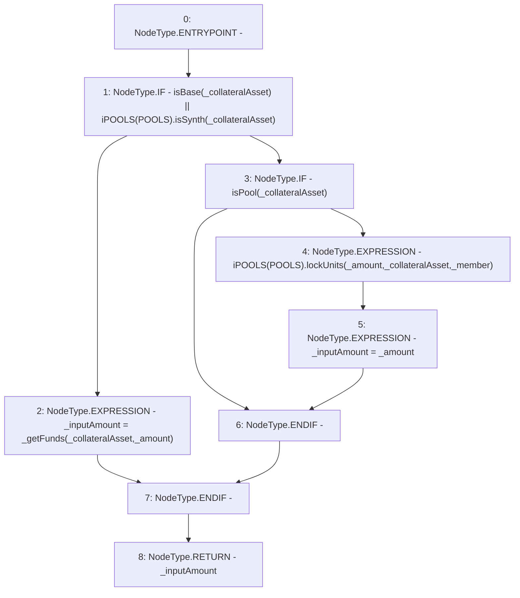

# Context: Router._handleTransferIn

**Contract:** `Router` (Inherits: None)
**Signature:** `_handleTransferIn(address,address,uint256) returns (uint256)`
**Method Selector ID:** `Internal (No Method ID)`
**Visibility:** `internal`
**Environment-Free:** `No (reads EVM state context)`
**Modifiers:** None

### State Variables Interaction
- **Reads:** POOLS
- **Writes:** None

### Environment & Verification Flags
- **Uses Foundry Cheatcodes:** No
- **Has Echidna Properties:** No

### Internal Calls Tree
- None

### External Calls / Value Transfers
- `iPOOLS.TMP_529(bool) = HIGH_LEVEL_CALL, dest:TMP_528(iPOOLS), function:isSynth, arguments:['_collateralAsset']  `
- `iPOOLS.HIGH_LEVEL_CALL, dest:TMP_533(iPOOLS), function:lockUnits, arguments:['_amount', '_collateralAsset', '_member']  `

### Control Flow Graph (CFG)


### Source Mapping
Declared in: `contracts/Router.sol` on lines **386** to **393**

```solidity
    function _handleTransferIn(address _member, address _collateralAsset, uint _amount) internal returns(uint _inputAmount){
        if(isBase(_collateralAsset) || iPOOLS(POOLS).isSynth(_collateralAsset)){
            _inputAmount = _getFunds(_collateralAsset, _amount); // Get funds
        }else if(isPool(_collateralAsset)){
             iPOOLS(POOLS).lockUnits(_amount, _collateralAsset, _member); // Lock units to protocol
             _inputAmount = _amount;
        }
    }

```
