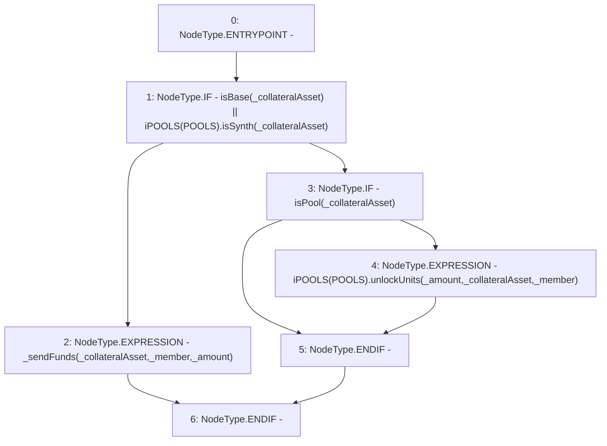

# Context: Router._handleTransferOut

**Contract:** `Router` (Inherits: None)
**Signature:** `_handleTransferOut(address,address,uint256)`
**Method Selector ID:** `Internal (No Method ID)`
**Visibility:** `internal`
**Environment-Free:** `Yes`
**Modifiers:** None

### State Variables Interaction
- **Reads:** POOLS
- **Writes:** None

### Environment & Verification Flags
- **Uses Foundry Cheatcodes:** No
- **Has Echidna Properties:** No

### Internal Calls Tree
- None

### External Calls / Value Transfers
- `iPOOLS.HIGH_LEVEL_CALL, dest:TMP_541(iPOOLS), function:unlockUnits, arguments:['_amount', '_collateralAsset', '_member']  `
- `iPOOLS.TMP_537(bool) = HIGH_LEVEL_CALL, dest:TMP_536(iPOOLS), function:isSynth, arguments:['_collateralAsset']  `

### Control Flow Graph (CFG)


### Source Mapping
Declared in: `contracts/Router.sol` on lines **395** to **401**

```solidity
    function _handleTransferOut(address _member, address _collateralAsset, uint _amount) internal{
        if(isBase(_collateralAsset) || iPOOLS(POOLS).isSynth(_collateralAsset)){
            _sendFunds(_collateralAsset, _member, _amount); // Send Base
        }else if(isPool(_collateralAsset)){
            iPOOLS(POOLS).unlockUnits(_amount, _collateralAsset, _member); // Unlock units to member
        }
    }

```
