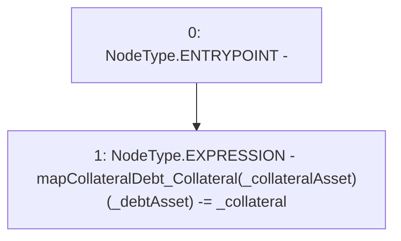

# Context: Router._removeCollateral

**Contract:** `Router` (Inherits: None)
**Signature:** `_removeCollateral(uint256,address,address)`
**Method Selector ID:** `Internal (No Method ID)`
**Visibility:** `internal`
**Environment-Free:** `Yes`
**Modifiers:** None

### State Variables Interaction
- **Reads:** mapCollateralDebt_Collateral
- **Writes:** mapCollateralDebt_Collateral

### Environment & Verification Flags
- **Uses Foundry Cheatcodes:** No
- **Has Echidna Properties:** No

### Internal Calls Tree
- None

### External Calls / Value Transfers
- None

### Control Flow Graph (CFG)


### Source Mapping
Declared in: `contracts/Router.sol` on lines **425** to **427**

```solidity
    function _removeCollateral(uint _collateral, address _collateralAsset, address _debtAsset) internal {
        mapCollateralDebt_Collateral[_collateralAsset][_debtAsset] -= _collateral;               // Record collateral 
    }

```
