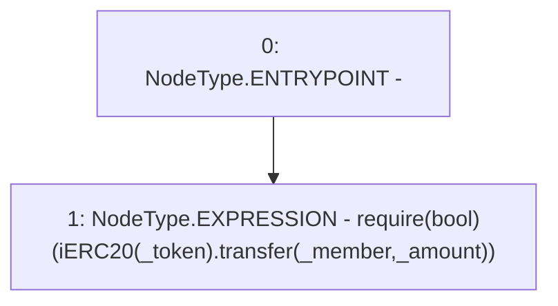

# Context: Router._sendFunds

**Contract:** `Router` (Inherits: None)
**Signature:** `_sendFunds(address,address,uint256)`
**Method Selector ID:** `Internal (No Method ID)`
**Visibility:** `internal`
**Environment-Free:** `Yes`
**Modifiers:** None

### State Variables Interaction
- **Reads:** None
- **Writes:** None

### Assertion Checks & Business Requirements
- require/assert: `require(bool)(iERC20(_token).transfer(_member,_amount))`

### Environment & Verification Flags
- **Uses Foundry Cheatcodes:** No
- **Has Echidna Properties:** No

### Internal Calls Tree
- None

### External Calls / Value Transfers
- `iERC20.TMP_560(bool) = HIGH_LEVEL_CALL, dest:TMP_559(iERC20), function:transfer, arguments:['_member', '_amount']  `

### Control Flow Graph (CFG)


### Source Mapping
Declared in: `contracts/Router.sol` on lines **413** to **415**

```solidity
    function _sendFunds(address _token, address _member, uint _amount) internal {
        require(iERC20(_token).transfer(_member, _amount));
    }

```
