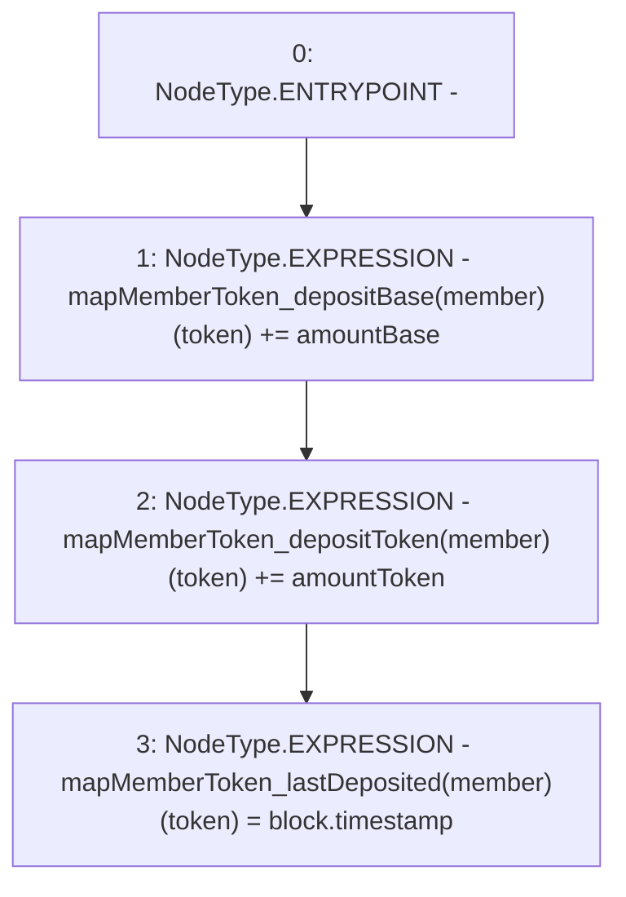

# Context: Router.addDepositData

**Contract:** `Router` (Inherits: None)
**Signature:** `addDepositData(address,address,uint256,uint256)`
**Method Selector ID:** `Internal (No Method ID)`
**Visibility:** `internal`
**Environment-Free:** `No (reads EVM state context)`
**Modifiers:** None

### State Variables Interaction
- **Reads:** mapMemberToken_depositBase, mapMemberToken_depositToken
- **Writes:** mapMemberToken_depositBase, mapMemberToken_depositToken, mapMemberToken_lastDeposited

### Environment & Verification Flags
- **Uses Foundry Cheatcodes:** No
- **Has Echidna Properties:** No

### Internal Calls Tree
- None

### External Calls / Value Transfers
- None

### Control Flow Graph (CFG)


### Source Mapping
Declared in: `contracts/Router.sol` on lines **196** to **200**

```solidity
    function addDepositData(address member, address token, uint amountBase, uint amountToken) internal {
        mapMemberToken_depositBase[member][token] += amountBase;
        mapMemberToken_depositToken[member][token] += amountToken;
        mapMemberToken_lastDeposited[member][token] = block.timestamp;
    }

```
