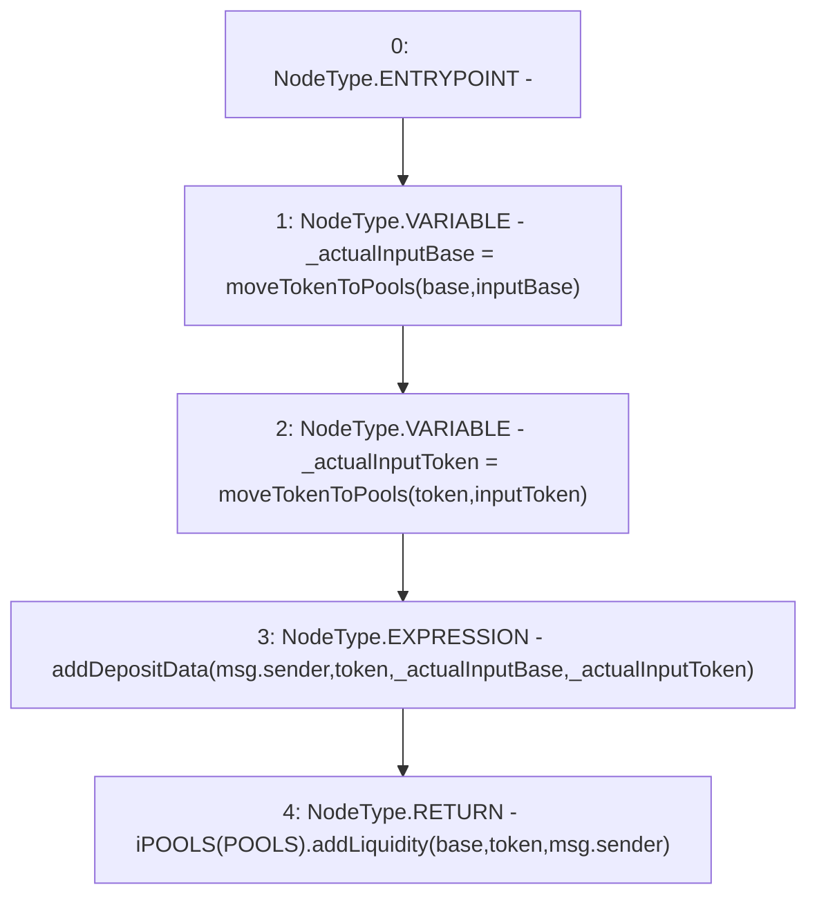

# Context: Router.addLiquidity

**Contract:** `Router` (Inherits: None)
**Signature:** `addLiquidity(address,uint256,address,uint256) returns (uint256)`
**Method Selector ID:** `0x376d3d5d`
**Visibility:** `external`
**Environment-Free:** `No (reads EVM state context)`
**Modifiers:** None

### State Variables Interaction
- **Reads:** POOLS
- **Writes:** None

### Environment & Verification Flags
- **Uses Foundry Cheatcodes:** No
- **Has Echidna Properties:** No

### Internal Calls Tree
- None

### External Calls / Value Transfers
- `iPOOLS.TMP_272(uint256) = HIGH_LEVEL_CALL, dest:TMP_271(iPOOLS), function:addLiquidity, arguments:['base', 'token', 'msg.sender']  `

### Control Flow Graph (CFG)


### Source Mapping
Declared in: `contracts/Router.sol` on lines **106** to **111**

```solidity
    function addLiquidity(address base, uint inputBase, address token, uint inputToken) external returns(uint){
        uint _actualInputBase = moveTokenToPools(base, inputBase);
        uint _actualInputToken = moveTokenToPools(token, inputToken);
        addDepositData(msg.sender, token, _actualInputBase, _actualInputToken); 
        return iPOOLS(POOLS).addLiquidity(base, token, msg.sender);
    }

```
