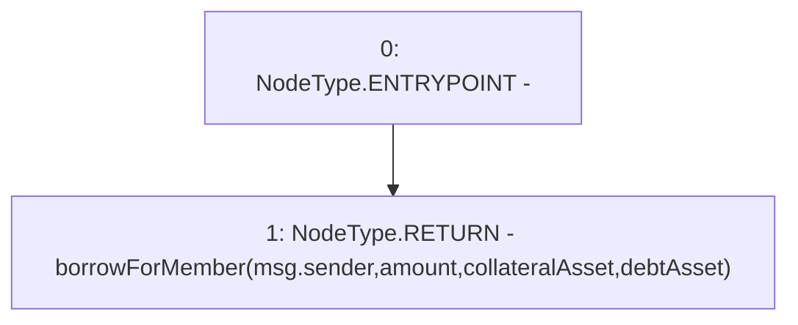

# Context: Router.borrow

**Contract:** `Router` (Inherits: None)
**Signature:** `borrow(uint256,address,address) returns (uint256)`
**Method Selector ID:** `0xd5164184`
**Visibility:** `public`
**Environment-Free:** `No (reads EVM state context)`
**Modifiers:** None

### State Variables Interaction
- **Reads:** None
- **Writes:** None

### Environment & Verification Flags
- **Uses Foundry Cheatcodes:** No
- **Has Echidna Properties:** No

### Internal Calls Tree
- None

### External Calls / Value Transfers
- None

### Control Flow Graph (CFG)


### Source Mapping
Declared in: `contracts/Router.sol` on lines **310** to **312**

```solidity
    function borrow(uint amount, address collateralAsset, address debtAsset) public returns (uint) {
        return borrowForMember(msg.sender, amount, collateralAsset, debtAsset);
    }

```
