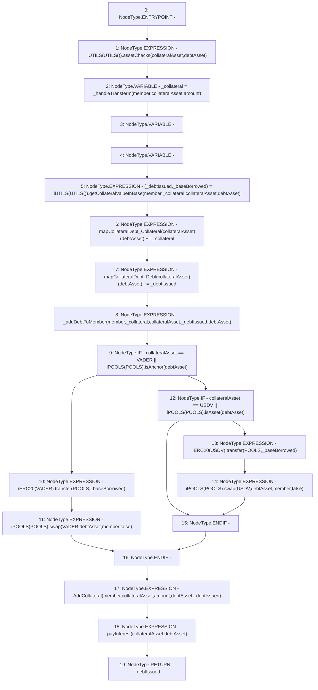

# Context: Router.borrowForMember

**Contract:** `Router` (Inherits: None)
**Signature:** `borrowForMember(address,uint256,address,address) returns (uint256)`
**Method Selector ID:** `0x1ab73ef5`
**Visibility:** `public`
**Environment-Free:** `No (reads EVM state context)`
**Modifiers:** None

### State Variables Interaction
- **Reads:** POOLS, USDV, VADER, mapCollateralDebt_Collateral, mapCollateralDebt_Debt
- **Writes:** mapCollateralDebt_Collateral, mapCollateralDebt_Debt

### Environment & Verification Flags
- **Uses Foundry Cheatcodes:** No
- **Has Echidna Properties:** No

### Internal Calls Tree
- None

### External Calls / Value Transfers
- `iPOOLS.TMP_465(uint256) = HIGH_LEVEL_CALL, dest:TMP_464(iPOOLS), function:swap, arguments:['VADER', 'debtAsset', 'member', 'False']  `
- `iPOOLS.TMP_473(uint256) = HIGH_LEVEL_CALL, dest:TMP_472(iPOOLS), function:swap, arguments:['USDV', 'debtAsset', 'member', 'False']  `
- `iERC20.TMP_463(bool) = HIGH_LEVEL_CALL, dest:TMP_462(iERC20), function:transfer, arguments:['POOLS', '_baseBorrowed']  `
- `iPOOLS.TMP_460(bool) = HIGH_LEVEL_CALL, dest:TMP_459(iPOOLS), function:isAnchor, arguments:['debtAsset']  `
- `iPOOLS.TMP_468(bool) = HIGH_LEVEL_CALL, dest:TMP_467(iPOOLS), function:isAsset, arguments:['debtAsset']  `
- `iUTILS.TUPLE_3(uint256,uint256) = HIGH_LEVEL_CALL, dest:TMP_456(iUTILS), function:getCollateralValueInBase, arguments:['member', '_collateral', 'collateralAsset', 'debtAsset']  `
- `iUTILS.HIGH_LEVEL_CALL, dest:TMP_452(iUTILS), function:assetChecks, arguments:['collateralAsset', 'debtAsset']  `
- `iERC20.TMP_471(bool) = HIGH_LEVEL_CALL, dest:TMP_470(iERC20), function:transfer, arguments:['POOLS', '_baseBorrowed']  `

### Control Flow Graph (CFG)


### Source Mapping
Declared in: `contracts/Router.sol` on lines **314** to **331**

```solidity
    function borrowForMember(address member, uint amount, address collateralAsset, address debtAsset) public returns(uint) {
        iUTILS(UTILS()).assetChecks(collateralAsset, debtAsset);
        uint _collateral = _handleTransferIn(member, collateralAsset, amount);                  // get collateral 
        (uint _debtIssued, uint _baseBorrowed) = iUTILS(UTILS()).getCollateralValueInBase(member, _collateral, collateralAsset, debtAsset);
        mapCollateralDebt_Collateral[collateralAsset][debtAsset] += _collateral;               // Record collateral 
        mapCollateralDebt_Debt[collateralAsset][debtAsset] += _debtIssued;                            // Record debt
        _addDebtToMember(member, _collateral, collateralAsset, _debtIssued, debtAsset);    // Update member details
        if(collateralAsset == VADER || iPOOLS(POOLS).isAnchor(debtAsset)){
            iERC20(VADER).transfer(POOLS, _baseBorrowed);                                  // Send to pools
            iPOOLS(POOLS).swap(VADER, debtAsset, member, false);                         // Execute swap to member
        } else if(collateralAsset == USDV || iPOOLS(POOLS).isAsset(debtAsset)) {
            iERC20(USDV).transfer(POOLS, _baseBorrowed);                                  // Send to pools
            iPOOLS(POOLS).swap(USDV, debtAsset, member, false);                         // Execute swap to member
        }
        emit AddCollateral(member, collateralAsset, amount, debtAsset, _debtIssued);               // Event
        payInterest(collateralAsset, debtAsset);
        return _debtIssued;
    }

```
