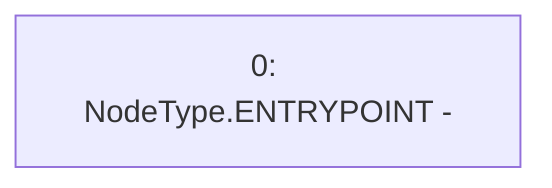

# Context: Router.checkLiquidate

**Contract:** `Router` (Inherits: None)
**Signature:** `checkLiquidate()`
**Method Selector ID:** `0x58b27216`
**Visibility:** `public`
**Environment-Free:** `Yes`
**Modifiers:** None

### State Variables Interaction
- **Reads:** None
- **Writes:** None

### Environment & Verification Flags
- **Uses Foundry Cheatcodes:** No
- **Has Echidna Properties:** No

### Internal Calls Tree
- None

### External Calls / Value Transfers
- None

### Control Flow Graph (CFG)


### Source Mapping
Declared in: `contracts/Router.sol` on lines **375** to **379**

```solidity
    function checkLiquidate() public {
        // get member remaining Collateral: originalDeposit - shareOfInterestPayments
        // if remainingCollateral <= 101% * debtValueInCollateral
        // purge, send remaining collateral to liquidator
    }

```
