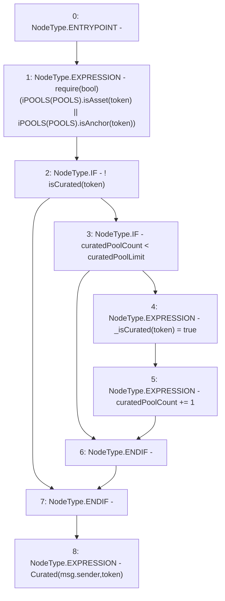

# Context: Router.curatePool

**Contract:** `Router` (Inherits: None)
**Signature:** `curatePool(address)`
**Method Selector ID:** `0xd2b43373`
**Visibility:** `external`
**Environment-Free:** `No (reads EVM state context)`
**Modifiers:** None

### State Variables Interaction
- **Reads:** POOLS, curatedPoolCount, curatedPoolLimit
- **Writes:** _isCurated, curatedPoolCount

### Assertion Checks & Business Requirements
- require/assert: `require(bool)(iPOOLS(POOLS).isAsset(token) || iPOOLS(POOLS).isAnchor(token))`

### Environment & Verification Flags
- **Uses Foundry Cheatcodes:** No
- **Has Echidna Properties:** No

### Internal Calls Tree
- None

### External Calls / Value Transfers
- `iPOOLS.TMP_379(bool) = HIGH_LEVEL_CALL, dest:TMP_378(iPOOLS), function:isAnchor, arguments:['token']  `
- `iPOOLS.TMP_377(bool) = HIGH_LEVEL_CALL, dest:TMP_376(iPOOLS), function:isAsset, arguments:['token']  `

### Control Flow Graph (CFG)


### Source Mapping
Declared in: `contracts/Router.sol` on lines **224** to **233**

```solidity
    function curatePool(address token) external {
        require(iPOOLS(POOLS).isAsset(token) || iPOOLS(POOLS).isAnchor(token));
        if(!isCurated(token)){
            if(curatedPoolCount < curatedPoolLimit){ // Limit
                _isCurated[token] = true;
                curatedPoolCount += 1;
            }
        }
        emit Curated(msg.sender, token);
    }

```
