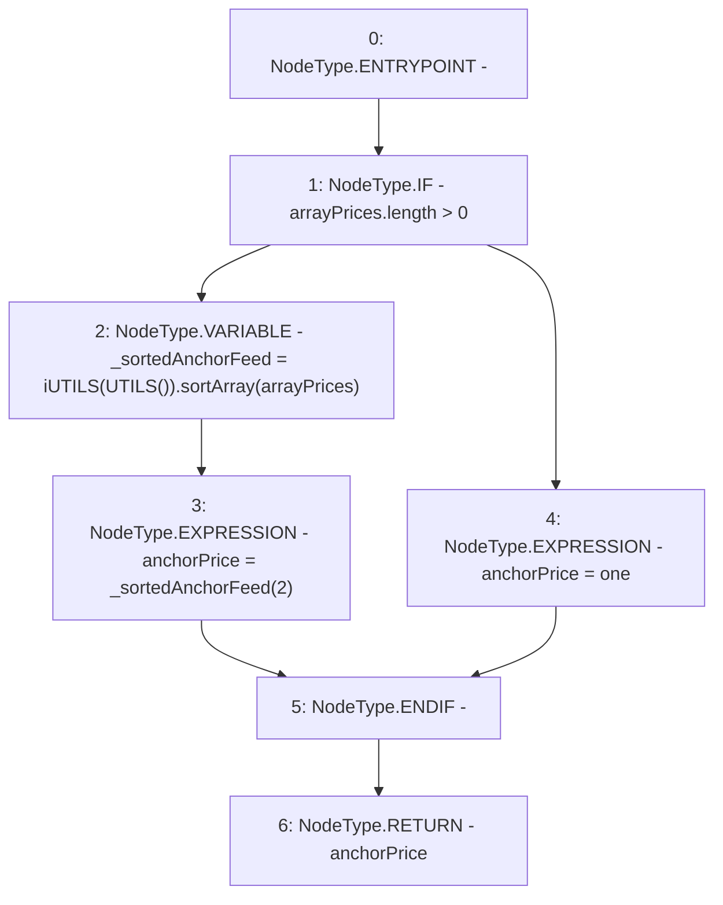

# Context: Router.getAnchorPrice

**Contract:** `Router` (Inherits: None)
**Signature:** `getAnchorPrice() returns (uint256)`
**Method Selector ID:** `0x038e5eaa`
**Visibility:** `public`
**Environment-Free:** `Yes`
**Modifiers:** None

### State Variables Interaction
- **Reads:** arrayPrices, one
- **Writes:** None

### Environment & Verification Flags
- **Uses Foundry Cheatcodes:** No
- **Has Echidna Properties:** No

### Internal Calls Tree
- None

### External Calls / Value Transfers
- `iUTILS.TMP_443(uint256[]) = HIGH_LEVEL_CALL, dest:TMP_442(iUTILS), function:sortArray, arguments:['arrayPrices']  `

### Control Flow Graph (CFG)


### Source Mapping
Declared in: `contracts/Router.sol` on lines **285** to **292**

```solidity
    function getAnchorPrice() public view returns (uint anchorPrice) {
        if(arrayPrices.length > 0){
            uint[] memory _sortedAnchorFeed = iUTILS(UTILS()).sortArray(arrayPrices);  // Sort price array, no need to modify storage
            anchorPrice = _sortedAnchorFeed[2];                         // Return the middle
        } else {
            anchorPrice = one;          // Edge case for first USDV mint
        }
    }

```
