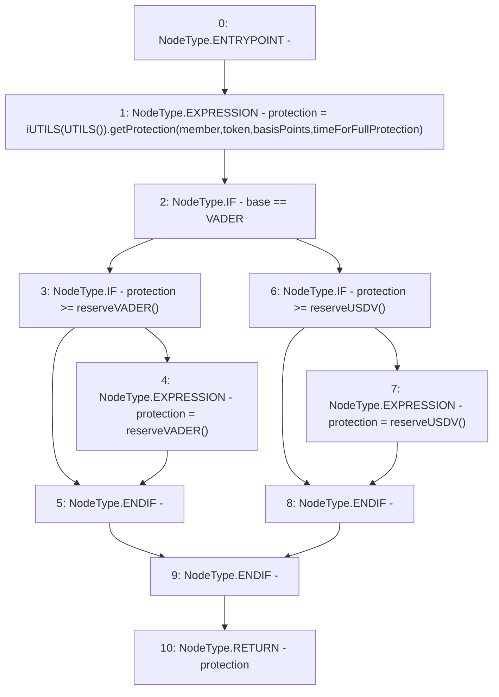

# Context: Router.getILProtection

**Contract:** `Router` (Inherits: None)
**Signature:** `getILProtection(address,address,address,uint256) returns (uint256)`
**Method Selector ID:** `0xe6048ff8`
**Visibility:** `public`
**Environment-Free:** `Yes`
**Modifiers:** None

### State Variables Interaction
- **Reads:** VADER, timeForFullProtection
- **Writes:** None

### Environment & Verification Flags
- **Uses Foundry Cheatcodes:** No
- **Has Echidna Properties:** No

### Internal Calls Tree
- None

### External Calls / Value Transfers
- `iUTILS.TMP_368(uint256) = HIGH_LEVEL_CALL, dest:TMP_367(iUTILS), function:getProtection, arguments:['member', 'token', 'basisPoints', 'timeForFullProtection']  `

### Control Flow Graph (CFG)


### Source Mapping
Declared in: `contracts/Router.sol` on lines **209** to **220**

```solidity
    function getILProtection(address member, address base, address token, uint basisPoints) public view returns(uint protection) {
        protection = iUTILS(UTILS()).getProtection(member, token, basisPoints, timeForFullProtection);
        if(base == VADER){
            if(protection >= reserveVADER()){
                protection = reserveVADER(); // In case reserve is running out
            }
        } else {
            if(protection >= reserveUSDV()){
                protection = reserveUSDV(); // In case reserve is running out
            }
        }
    }

```
