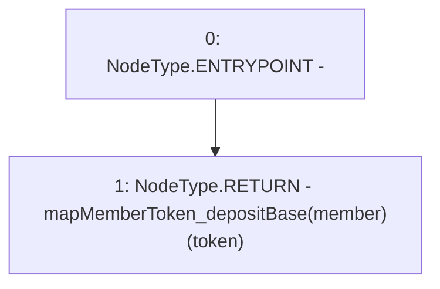

# Context: Router.getMemberBaseDeposit

**Contract:** `Router` (Inherits: None)
**Signature:** `getMemberBaseDeposit(address,address) returns (uint256)`
**Method Selector ID:** `0xff8b83a6`
**Visibility:** `external`
**Environment-Free:** `Yes`
**Modifiers:** None

### State Variables Interaction
- **Reads:** mapMemberToken_depositBase
- **Writes:** None

### Environment & Verification Flags
- **Uses Foundry Cheatcodes:** No
- **Has Echidna Properties:** No

### Internal Calls Tree
- None

### External Calls / Value Transfers
- None

### Control Flow Graph (CFG)


### Source Mapping
Declared in: `contracts/Router.sol` on lines **484** to **486**

```solidity
    function getMemberBaseDeposit(address member, address token) external view returns(uint) {
        return mapMemberToken_depositBase[member][token];
    }

```
