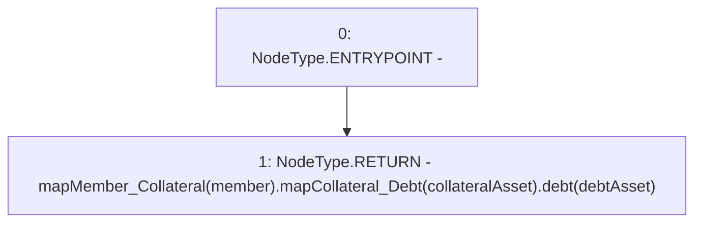

# Context: Router.getMemberDebt

**Contract:** `Router` (Inherits: None)
**Signature:** `getMemberDebt(address,address,address) returns (uint256)`
**Method Selector ID:** `0xcbc17db3`
**Visibility:** `public`
**Environment-Free:** `Yes`
**Modifiers:** None

### State Variables Interaction
- **Reads:** mapMember_Collateral
- **Writes:** None

### Environment & Verification Flags
- **Uses Foundry Cheatcodes:** No
- **Has Echidna Properties:** No

### Internal Calls Tree
- None

### External Calls / Value Transfers
- None

### Control Flow Graph (CFG)


### Source Mapping
Declared in: `contracts/Router.sol` on lines **496** to **498**

```solidity
    function getMemberDebt(address member, address collateralAsset, address debtAsset) public view returns(uint) {
        return mapMember_Collateral[member].mapCollateral_Debt[collateralAsset].debt[debtAsset];
    }

```
