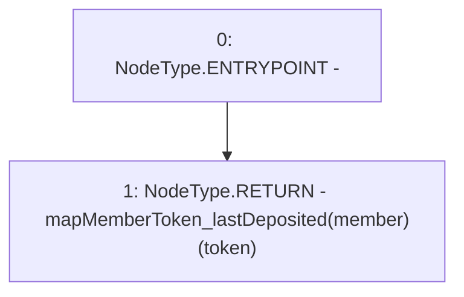

# Context: Router.getMemberLastDeposit

**Contract:** `Router` (Inherits: None)
**Signature:** `getMemberLastDeposit(address,address) returns (uint256)`
**Method Selector ID:** `0x6a87def5`
**Visibility:** `external`
**Environment-Free:** `Yes`
**Modifiers:** None

### State Variables Interaction
- **Reads:** mapMemberToken_lastDeposited
- **Writes:** None

### Environment & Verification Flags
- **Uses Foundry Cheatcodes:** No
- **Has Echidna Properties:** No

### Internal Calls Tree
- None

### External Calls / Value Transfers
- None

### Control Flow Graph (CFG)


### Source Mapping
Declared in: `contracts/Router.sol` on lines **490** to **492**

```solidity
    function getMemberLastDeposit(address member, address token) external view returns(uint) {
        return mapMemberToken_lastDeposited[member][token];
    }

```
