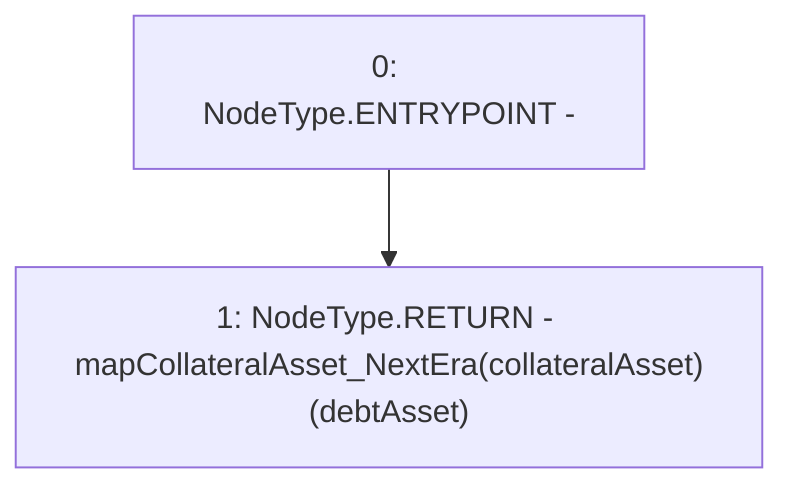

# Context: Router.getNextEraTime

**Contract:** `Router` (Inherits: None)
**Signature:** `getNextEraTime(address,address) returns (uint256)`
**Method Selector ID:** `0x37f3d2d4`
**Visibility:** `public`
**Environment-Free:** `Yes`
**Modifiers:** None

### State Variables Interaction
- **Reads:** mapCollateralAsset_NextEra
- **Writes:** None

### Environment & Verification Flags
- **Uses Foundry Cheatcodes:** No
- **Has Echidna Properties:** No

### Internal Calls Tree
- None

### External Calls / Value Transfers
- None

### Control Flow Graph (CFG)


### Source Mapping
Declared in: `contracts/Router.sol` on lines **508** to **510**

```solidity
    function getNextEraTime(address collateralAsset, address debtAsset) public view returns(uint) {
        return mapCollateralAsset_NextEra[collateralAsset][debtAsset];
    }

```
