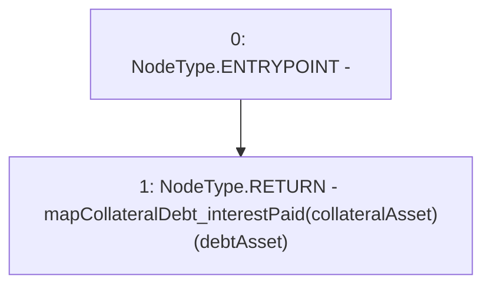

# Context: Router.getSystemInterestPaid

**Contract:** `Router` (Inherits: None)
**Signature:** `getSystemInterestPaid(address,address) returns (uint256)`
**Method Selector ID:** `0xe0f52db3`
**Visibility:** `public`
**Environment-Free:** `Yes`
**Modifiers:** None

### State Variables Interaction
- **Reads:** mapCollateralDebt_interestPaid
- **Writes:** None

### Environment & Verification Flags
- **Uses Foundry Cheatcodes:** No
- **Has Echidna Properties:** No

### Internal Calls Tree
- None

### External Calls / Value Transfers
- None

### Control Flow Graph (CFG)


### Source Mapping
Declared in: `contracts/Router.sol` on lines **505** to **507**

```solidity
    function getSystemInterestPaid(address collateralAsset, address debtAsset) public view returns(uint) {
        return mapCollateralDebt_interestPaid[collateralAsset][debtAsset];
    }

```
