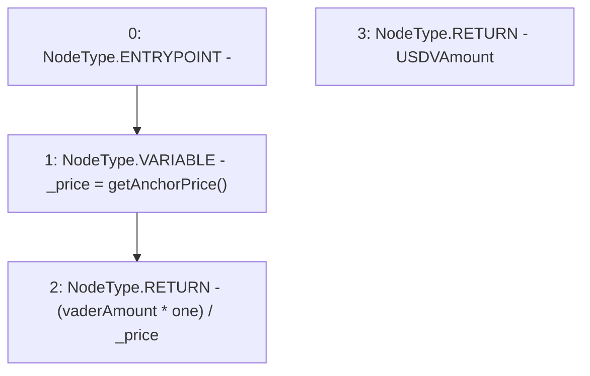

# Context: Router.getUSDVAmount

**Contract:** `Router` (Inherits: None)
**Signature:** `getUSDVAmount(uint256) returns (uint256)`
**Method Selector ID:** `0x5a4dd3f2`
**Visibility:** `public`
**Environment-Free:** `Yes`
**Modifiers:** None

### State Variables Interaction
- **Reads:** one
- **Writes:** None

### Environment & Verification Flags
- **Uses Foundry Cheatcodes:** No
- **Has Echidna Properties:** No

### Internal Calls Tree
- None

### External Calls / Value Transfers
- None

### Control Flow Graph (CFG)


### Source Mapping
Declared in: `contracts/Router.sol` on lines **301** to **304**

```solidity
    function getUSDVAmount(uint vaderAmount) public view returns (uint USDVAmount){
        uint _price = getAnchorPrice();
        return (vaderAmount * one) / _price;
    }

```
