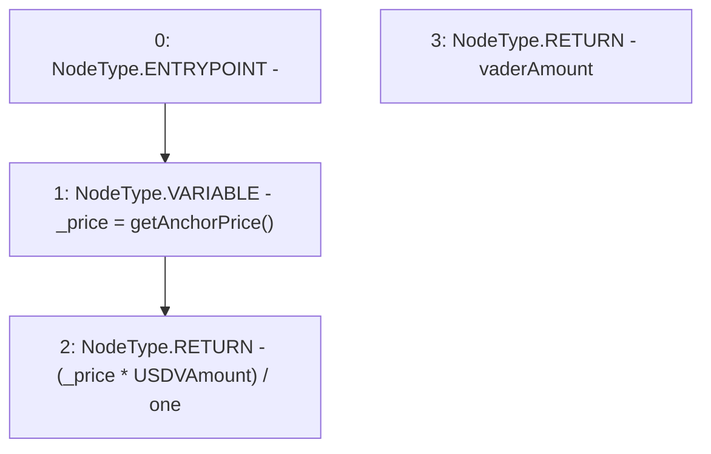

# Context: Router.getVADERAmount

**Contract:** `Router` (Inherits: None)
**Signature:** `getVADERAmount(uint256) returns (uint256)`
**Method Selector ID:** `0x6cc06ded`
**Visibility:** `public`
**Environment-Free:** `Yes`
**Modifiers:** None

### State Variables Interaction
- **Reads:** one
- **Writes:** None

### Environment & Verification Flags
- **Uses Foundry Cheatcodes:** No
- **Has Echidna Properties:** No

### Internal Calls Tree
- None

### External Calls / Value Transfers
- None

### Control Flow Graph (CFG)


### Source Mapping
Declared in: `contracts/Router.sol` on lines **295** to **298**

```solidity
    function getVADERAmount(uint USDVAmount) public view returns (uint vaderAmount){
        uint _price = getAnchorPrice();
        return (_price * USDVAmount) / one;
    }

```
