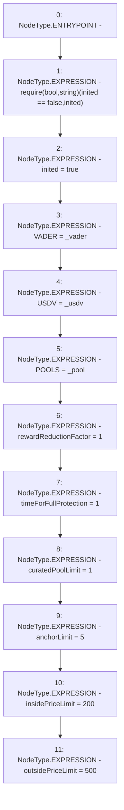

# Context: Router.init

**Contract:** `Router` (Inherits: None)
**Signature:** `init(address,address,address)`
**Method Selector ID:** `0x184b9559`
**Visibility:** `public`
**Environment-Free:** `Yes`
**Modifiers:** None

### State Variables Interaction
- **Reads:** inited
- **Writes:** POOLS, USDV, VADER, anchorLimit, curatedPoolLimit, inited, insidePriceLimit, outsidePriceLimit, rewardReductionFactor, timeForFullProtection

### Assertion Checks & Business Requirements
- require/assert: `require(bool,string)(inited == false,inited)`

### Environment & Verification Flags
- **Uses Foundry Cheatcodes:** No
- **Has Echidna Properties:** No

### Internal Calls Tree
- None

### External Calls / Value Transfers
- None

### Control Flow Graph (CFG)


### Source Mapping
Declared in: `contracts/Router.sol` on lines **77** to **89**

```solidity
    function init(address _vader, address _usdv, address _pool) public {
        require(inited == false,  "inited");
        inited = true;
        VADER = _vader;
        USDV = _usdv;
        POOLS = _pool;
        rewardReductionFactor = 1;
        timeForFullProtection = 1;//8640000; //100 days
        curatedPoolLimit = 1;
        anchorLimit = 5;
        insidePriceLimit = 200;
        outsidePriceLimit = 500;
    }

```
