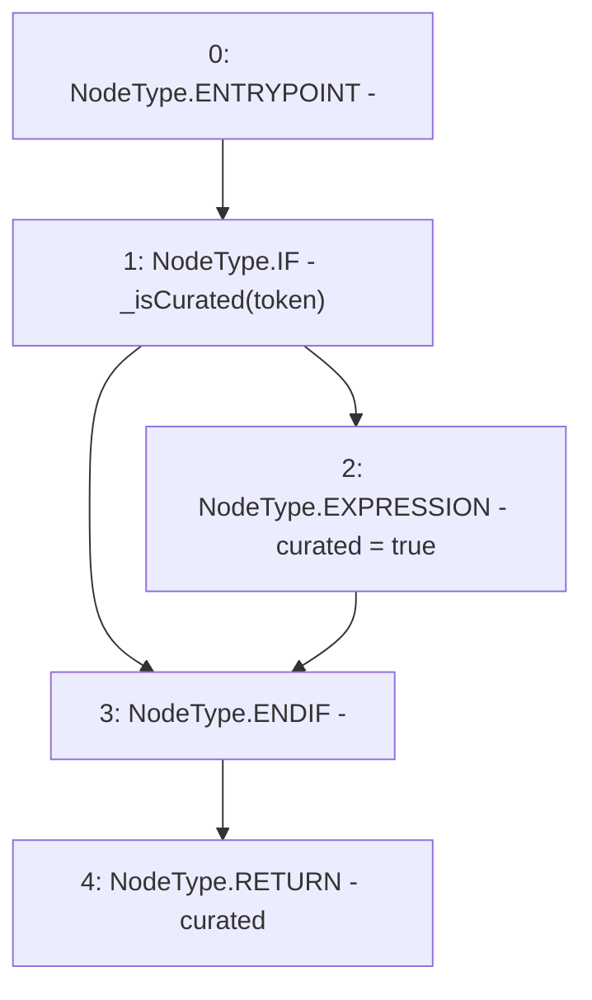

# Context: Router.isCurated

**Contract:** `Router` (Inherits: None)
**Signature:** `isCurated(address) returns (bool)`
**Method Selector ID:** `0x774d70e4`
**Visibility:** `public`
**Environment-Free:** `Yes`
**Modifiers:** None

### State Variables Interaction
- **Reads:** _isCurated
- **Writes:** None

### Environment & Verification Flags
- **Uses Foundry Cheatcodes:** No
- **Has Echidna Properties:** No

### Internal Calls Tree
- None

### External Calls / Value Transfers
- None

### Control Flow Graph (CFG)


### Source Mapping
Declared in: `contracts/Router.sol` on lines **473** to **477**

```solidity
    function isCurated(address token) public view returns(bool curated) {
        if(_isCurated[token]){
            curated = true;
        }
    }

```
