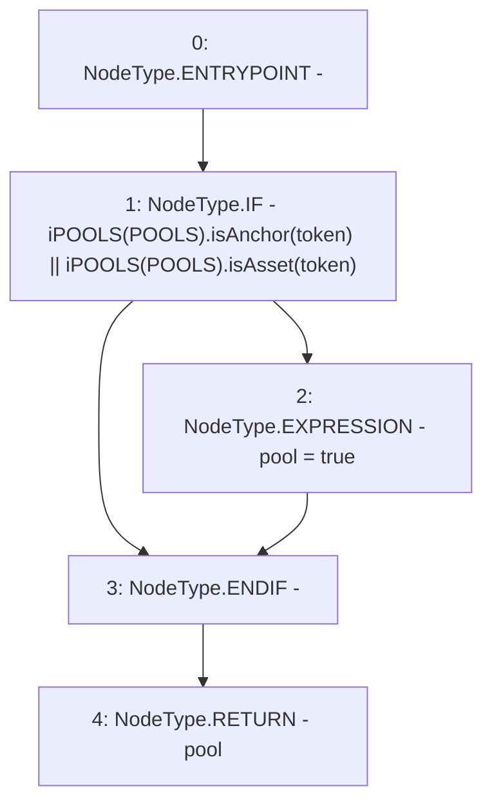

# Context: Router.isPool

**Contract:** `Router` (Inherits: None)
**Signature:** `isPool(address) returns (bool)`
**Method Selector ID:** `0x5b16ebb7`
**Visibility:** `public`
**Environment-Free:** `Yes`
**Modifiers:** None

### State Variables Interaction
- **Reads:** POOLS
- **Writes:** None

### Environment & Verification Flags
- **Uses Foundry Cheatcodes:** No
- **Has Echidna Properties:** No

### Internal Calls Tree
- None

### External Calls / Value Transfers
- `iPOOLS.TMP_598(bool) = HIGH_LEVEL_CALL, dest:TMP_597(iPOOLS), function:isAsset, arguments:['token']  `
- `iPOOLS.TMP_596(bool) = HIGH_LEVEL_CALL, dest:TMP_595(iPOOLS), function:isAnchor, arguments:['token']  `

### Control Flow Graph (CFG)


### Source Mapping
Declared in: `contracts/Router.sol` on lines **478** to **482**

```solidity
    function isPool(address token) public view returns(bool pool) {
        if(iPOOLS(POOLS).isAnchor(token) || iPOOLS(POOLS).isAsset(token)){
            pool = true;
        }
    }

```
