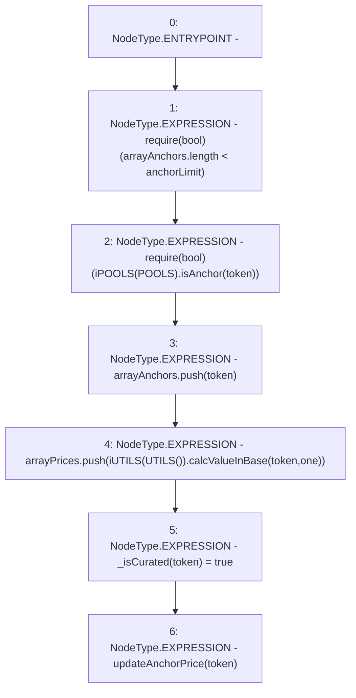

# Context: Router.listAnchor

**Contract:** `Router` (Inherits: None)
**Signature:** `listAnchor(address)`
**Method Selector ID:** `0x39e68f53`
**Visibility:** `external`
**Environment-Free:** `Yes`
**Modifiers:** None

### State Variables Interaction
- **Reads:** POOLS, anchorLimit, arrayAnchors, arrayPrices, one
- **Writes:** _isCurated, arrayAnchors, arrayPrices

### Assertion Checks & Business Requirements
- require/assert: `require(bool)(arrayAnchors.length < anchorLimit)`
- require/assert: `require(bool)(iPOOLS(POOLS).isAnchor(token))`

### Environment & Verification Flags
- **Uses Foundry Cheatcodes:** No
- **Has Echidna Properties:** No

### Internal Calls Tree
- None

### External Calls / Value Transfers
- `iUTILS.TMP_405(uint256) = HIGH_LEVEL_CALL, dest:TMP_404(iUTILS), function:calcValueInBase, arguments:['token', 'one']  `
- `iPOOLS.TMP_398(bool) = HIGH_LEVEL_CALL, dest:TMP_397(iPOOLS), function:isAnchor, arguments:['token']  `

### Control Flow Graph (CFG)


### Source Mapping
Declared in: `contracts/Router.sol` on lines **245** to **252**

```solidity
    function listAnchor(address token) external {
        require(arrayAnchors.length < anchorLimit); // Limit
        require(iPOOLS(POOLS).isAnchor(token));     // Must be anchor
        arrayAnchors.push(token);                   // Add
        arrayPrices.push(iUTILS(UTILS()).calcValueInBase(token, one));
        _isCurated[token] = true; 
        updateAnchorPrice(token);
    }

```
