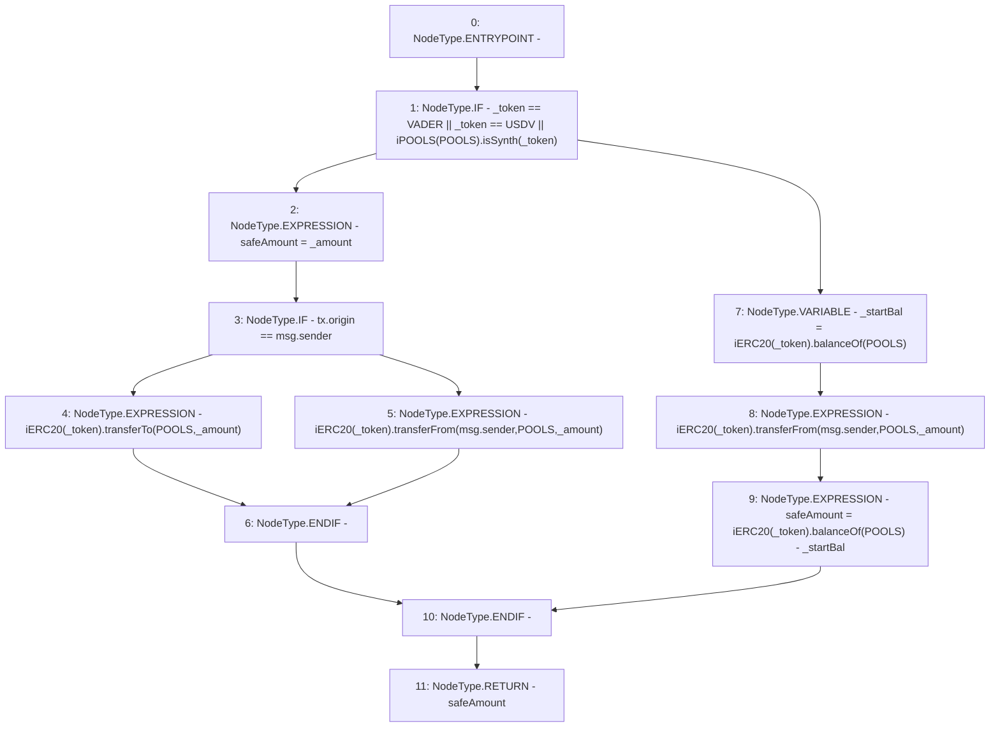

# Context: Router.moveTokenToPools

**Contract:** `Router` (Inherits: None)
**Signature:** `moveTokenToPools(address,uint256) returns (uint256)`
**Method Selector ID:** `Internal (No Method ID)`
**Visibility:** `internal`
**Environment-Free:** `No (reads EVM state context)`
**Modifiers:** None

### State Variables Interaction
- **Reads:** POOLS, USDV, VADER
- **Writes:** None

### Environment & Verification Flags
- **Uses Foundry Cheatcodes:** No
- **Has Echidna Properties:** No

### Internal Calls Tree
- None

### External Calls / Value Transfers
- `iERC20.TMP_581(bool) = HIGH_LEVEL_CALL, dest:TMP_580(iERC20), function:transferFrom, arguments:['msg.sender', 'POOLS', '_amount']  `
- `iPOOLS.TMP_575(bool) = HIGH_LEVEL_CALL, dest:TMP_574(iPOOLS), function:isSynth, arguments:['_token']  `
- `iERC20.TMP_585(bool) = HIGH_LEVEL_CALL, dest:TMP_584(iERC20), function:transferFrom, arguments:['msg.sender', 'POOLS', '_amount']  `
- `iERC20.TMP_583(uint256) = HIGH_LEVEL_CALL, dest:TMP_582(iERC20), function:balanceOf, arguments:['POOLS']  `
- `iERC20.TMP_579(bool) = HIGH_LEVEL_CALL, dest:TMP_578(iERC20), function:transferTo, arguments:['POOLS', '_amount']  `
- `iERC20.TMP_587(uint256) = HIGH_LEVEL_CALL, dest:TMP_586(iERC20), function:balanceOf, arguments:['POOLS']  `

### Control Flow Graph (CFG)


### Source Mapping
Declared in: `contracts/Router.sol` on lines **447** to **460**

```solidity
    function moveTokenToPools(address _token, uint _amount) internal returns(uint safeAmount) {
        if(_token == VADER || _token == USDV || iPOOLS(POOLS).isSynth(_token)){
            safeAmount = _amount;
            if(tx.origin==msg.sender){
                iERC20(_token).transferTo(POOLS, _amount);
            }else{
                iERC20(_token).transferFrom(msg.sender, POOLS, _amount);
            }
        } else {
            uint _startBal = iERC20(_token).balanceOf(POOLS);
            iERC20(_token).transferFrom(msg.sender, POOLS, _amount);
            safeAmount = iERC20(_token).balanceOf(POOLS) - _startBal;
        }
    }

```
